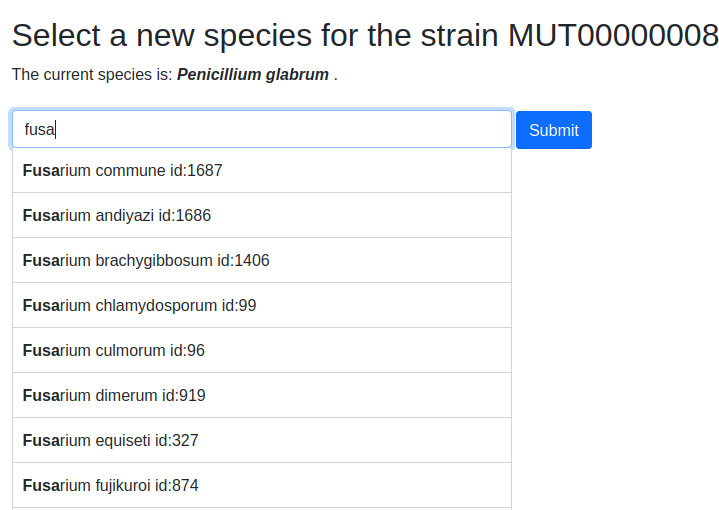
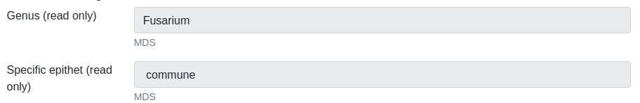
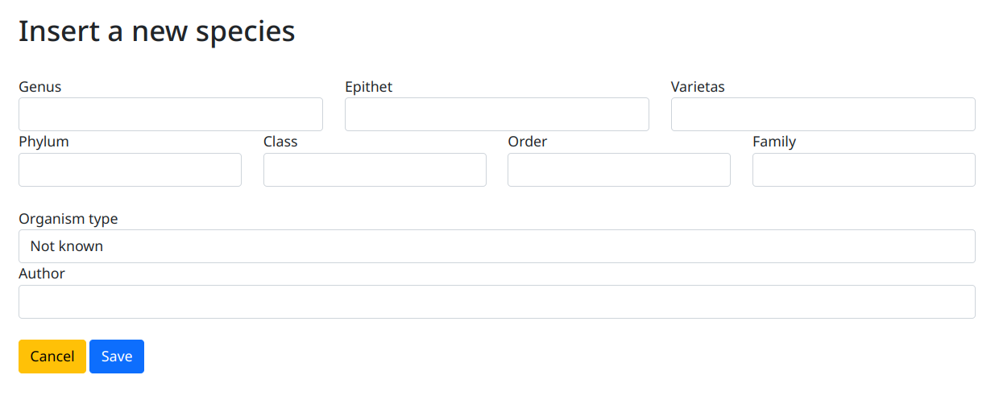
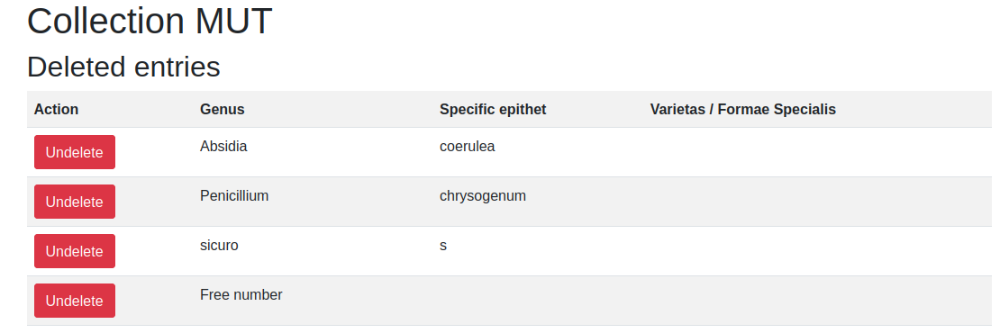

.. Administration tools

Insert a new strain
-------------------------------------------------

Questa opzione permette di inserire un nuovo ceppo nel database.

La prima tappa consiste nella scelta della specie.

Digitare i primi carattere del genere e quindi selezionare la specie nell'elenco proposto.
Premere il pulsante **Submit** per assegnare la nuova specie al ceppo.

**Se la specie non è presente nell'elenco delle specie una nuova specie dovrà essere creata**

Compilare i campi. I campi che presentono una stellina rossa sono obbligatori.

I campi con lo sfondo grigio (anche segnati come "read only") non sono modificabili.

I campi segnati con un asterisco rosso sono obbligatori e non possono essere lasciati vuoti.

Riferirsi alla sezione `elenco campi`_ per ottenere più informazione sui campi.

Al termine dell'immissione premere sul pulsante **Submit** in fondo a destra. Il sistema valida i campi e segnala se la scheda ceppo contiene errori o campi obbligatori non impostati.

Se l'immissione è andata a buon termine un messaggio su fondo verde comparirà.

Insert a new species
-------------------------------------------------

Per inserire una nuova specie premere il menù **Administration tools** >  **Insert a new species** 

Immettere le informazion nei vari campi selezionando il tipo di organismo tra le scelte proposte.
Al termine premere il pulsante **Save**

..
    Modificare una specie
    ~~~~~~~~~~~~~~~~~~~~~~~~~~~~~~~~~~~~~~~~~~~~~~~~

    Dall'elenco delle specie premere il pulsante **edit** in corrispondenza delle specie da modificare ed immettere le informazion nei vari campi.
    Al termine premere il pulsante **Save**

    Le modifiche eseguite sulla specie vengono riportate per ogni ceppo di questa specie nella collezione.

    Cancellare una specie
    ~~~~~~~~~~~~~~~~~~~~~~~~~~~~~~~~~~~~~~~~~~~~~~~~

    Per cancellare una specie premere il pulsante **view** in corrispondenza delle specie da cancellare.
    Quando le informazioni sulla specie compaiono premere il pulsante **Delete species** e dare conferma.
    Il privileggio **Administrator** è richiesto.

    .. image:: images/delete_species.png
        :alt: cancellare una specie
        :width: 80%

Strains quarantine
---------------------------------------------------

Questa funzione permette di accedere all'elenco dei depositi richiesti (quarantena).

Species quarantine
---------------------------------------------------

Questa funzione permette di accedere all'elenco delle specie in quarantena.

Export collection
---------------------------------------------------

I ceppi presenti nella collezioni possono essere esportati in formato XLSX (Microsoft-Excel).

Export collection to MIRRI
~~~~~~~~~~~~~~~~~~~~~~~~~~~~~~~~~~~

I dati dei ceppi segnati (campo **Export to MIRRI** impostato a **Yes**) sono salvati in un file in formato XLSX (Microsoft-Excel) che può essere direttamente trasmesso a MIRRI.

Export strains for Microsoft-Excel
~~~~~~~~~~~~~~~~~~~~~~~~~~~~~~~~~~~~~~~~~

I dati dei ceppi sono esportati in un file in formato XLSX (Microsoft-Excel).
Il file **non** contiene la letteratura, i documenti allegati, le sequenze nucleotidiche, i genomi e la letteratura legata alle sequenze.

Export Species for Microsoft-Excel
~~~~~~~~~~~~~~~~~~~~~~~~~~~~~~~~~~~~~~~~~

I dati delle specie presenti nella collezione sono esportati in un file in formato XLSX (Microsoft-Excel).
I campi sono i seguenti:

* Id
* Genus
* Epithet
* varietas
* Phylum
* Class
* Species order
* Family
* Organism type
* Author
* Number of strains

Growth media
---------------------------------------------------

Elenco dei terreni di coltura usati 

Deleted strains
---------------------------------------------------

Questa funzione permette di accedere all'elenco dei ceppi cancellati e di ripristinarli.
Il privileggio **Administrator** è richiesto.

Premere il pulsante **Undelete** in corrispondenza del ceppo da ripristinare e dare conferma.
Il ceppo sarà di nuovo visibile nell'elenco dei ceppi.

Deleted species
---------------------------------------------------

Questa funzione permette di accedere all'elenco delle specie cancellate e di ripristinarli.
Il privileggio **Administrator** è richiesto.

Premere il pulsante **Undelete** in corrispondenza della specie da ripristinare e dare conferma.
La specie sarà di nuovo visibile nell'elenco delle specie.

Super tools
---------------------------------------------------

Questa funzione permette di accedere a viste speciali sul database come l'elenco dei valori per un o più campi per tutti i ceppi oppure a tutti i valori distinti per un campo.
Il privileggio **Administrator** o **Advanced user** è richiesto.

Riferirsi alla sezione `super tools`_

