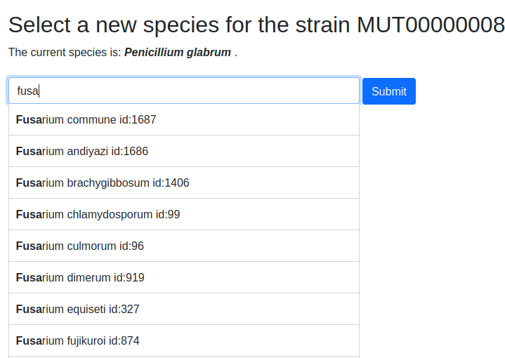
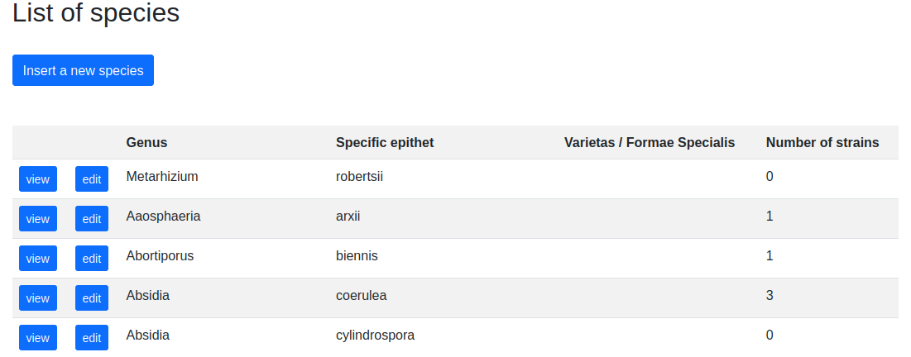
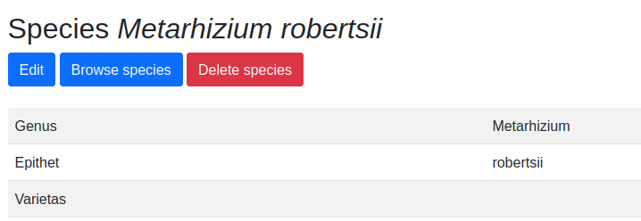
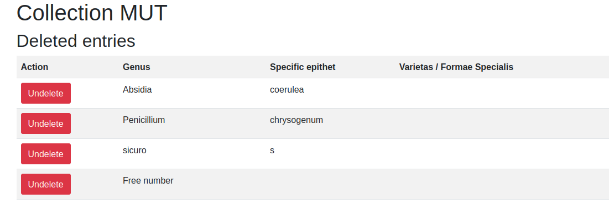

.. Administration tools

Insert a new strain
-------------------------------------------------

Questa opzione permette di inserire un nuovo ceppo nel database.

La prima tappa cnsiste nella scelta della specie.

Digitare i primi carattere del genere e quindi selezionare la specie nell'elenco proposto.
Premere il pulsante **Submit** per assegnare la nuova specie al ceppo.

Se la specie non è presente nell'elenco delle specie una nuova specie dovrà essere creata

Compilare i campi

I campi con lo sfondo grigio (anche segnati come "read only") non sono modificabili.

.. image:: campi_read_only.png
    :alt: seleziona una specie
    :width: 80%

I campi segnati con un asterisco rosso sono obbligatori e non possono essere lasciati vuoti.

Riferirsi alla sezione `elenco campi`_ per ottenere più informazione sui campi.

Al termine dell'immissione premere sul pulsante **Submit** in fondo a destra. Il sistema valida i campi e segnala se la scheda ceppo contiene errori o campi obbligatori non impostati.

Se l'immissione è andata a buon termine un messaggio su fondo verde comparirà.

Species management
---------------------------------------------------

Questa opzione permette di gestire le specie presenti nel database e di inserire nuove specie.

L'elenco della specie presenti nel database si presenta come segue:

La colonna **Number of strains** indica il numero di ceppi di questa specie presenti nella collezione.

Inserire una nuova specie
~~~~~~~~~~~~~~~~~~~~~~~~~~~~~~~~~~~~~~~~~~~~~~~~

Per inserire una nuova specie premere il pulsante **Insert a new specie** ed immettere le informazion nei vari campi.
Al termine premere il pulsante **Save**

Modificare una specie
~~~~~~~~~~~~~~~~~~~~~~~~~~~~~~~~~~~~~~~~~~~~~~~~

Dall'elenco delle specie premere il pulsante **edit** in corrispondenza delle specie da modificare ed immettere le informazion nei vari campi.
Al termine premere il pulsante **Save**

Le modifiche eseguite sulla specie vengono riportate per ogni ceppo di questa specie nella collezione.

Cancellare una specie
~~~~~~~~~~~~~~~~~~~~~~~~~~~~~~~~~~~~~~~~~~~~~~~~

Per cancellare una specie premere il pulsante **view** in corrispondenza delle specie da cancellare.
Quando le informazioni sulla specie compaiono premere il pulsante **Delete species** e dare conferma.
Il privileggio **Administrator** è richiesto.

Strains quarantine
---------------------------------------------------

Species quarantine
---------------------------------------------------

Export collection
---------------------------------------------------

I ceppi presenti nella collezioni possono essere esportati in un formato Excel (.xlsx)

Export to MIRRI
~~~~~~~~~~~~~~~~~~~~~~~~~~~~~~~~~~~

Export to Microsoft-Excel
~~~~~~~~~~~~~~~~~~~~~~~~~~~~~~~~~~~

Create labels for tubes/lyo
---------------------------------------------------

Deleted entries
---------------------------------------------------

Questa funzione permette di accedere all'elenco dei ceppi cancellati e di ripristinarli.
Iil privileggio **Administrator** è richiesto.

Super admin
---------------------------------------------------

Questa funzione permette di accedere a viste speciali sul database come l'elenco dei valori per un o più campi per tutti i ceppi oppure a tutti i valori distinti per un campo.
Il privileggio **Administrator** è richiesto.

Riferirsi alla sezione `super admin`_

