.. aggiornamento sito MUT

Il contenuto del sito MUT è gestito tramite il seguente repository GitHub:

`www.tucc-database.unito.it/new_mut <https://www.tucc-database.unito.it/new_mut>`_

La procedura per apportare modifiche o aggiunte al sito si articola in 2 fasi:

1) Modifica e/o aggiunta del contenuto sul repository GitHub

2) Generazione del sito

Modifica / aggiunta del contenuto sul repository GitHub
-----------------------------------------------------------------------------

* Collegarsi al repository GitHub: `https://github.com/olivierfriard/mut_site <https://github.com/olivierfriard/mut_site>`_

La pagina ha l'aspetto seguente, la parte centrale presenta un elenco di file.

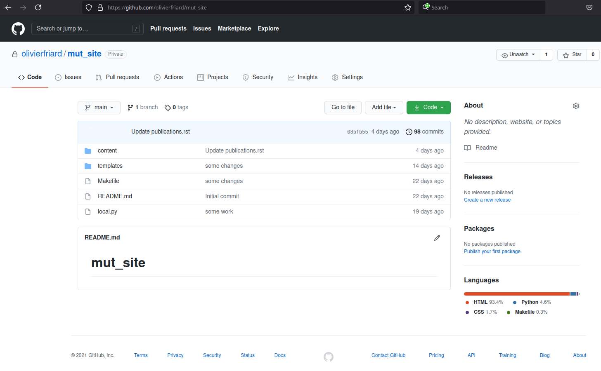

* Aprire la cartella **content** cliccando sopra

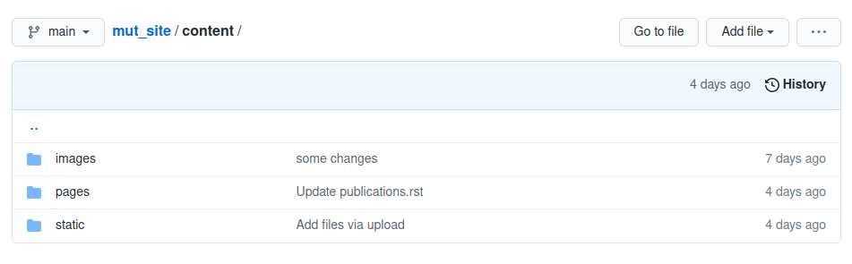

* Aprire la cartella **pages** cliccando sopra

La cartella **pages** presenta un elenco di file con l'estensione **.rst**.
Questi file sono file di testo e possono essere editati direttamente on-line.

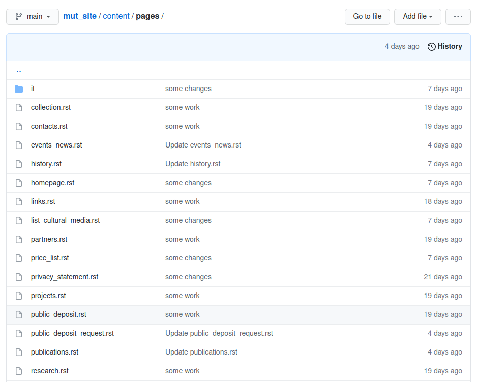

Edizione di un file .rst (sito web versione inglese)
~~~~~~~~~~~~~~~~~~~~~~~~~~~~~~~~~~~~~~~~~~~~~~~~~~~~~~~~~~~~~~~~~~~~~~~

* Cliccare il sul file **.rst** desiderato. Nel esempio seguente il file **contacts.rst** verrà utilizzato.

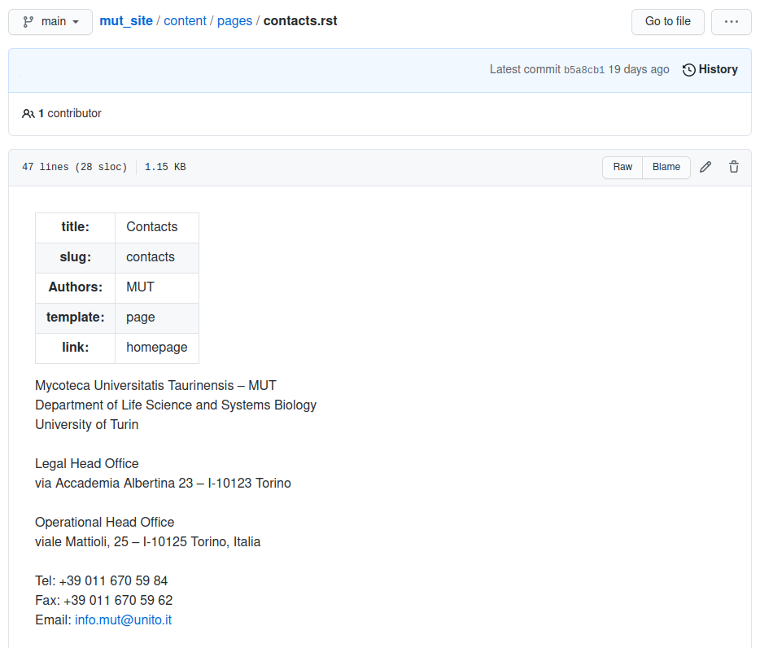

* Cliccare sul pulsante **Penna**

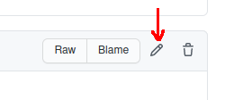

La schermata presenta un editore che permette di modificare il file aperto (nel esempio seguente **contacts.rst**)

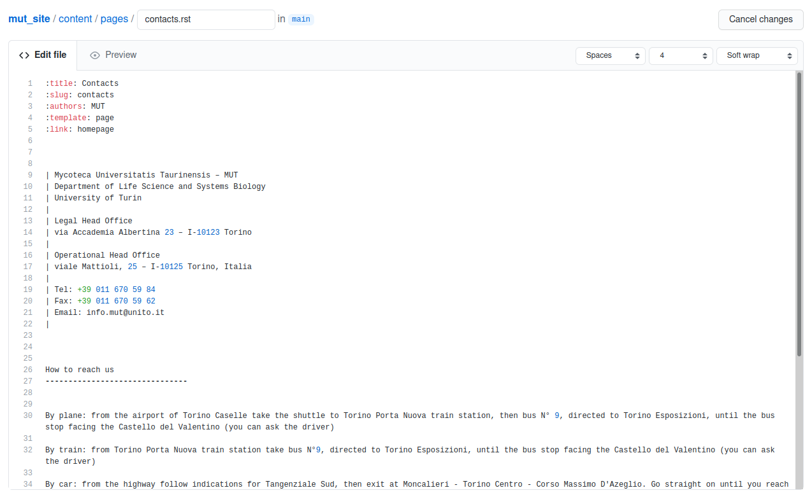

E' possibile modificare il testo e aggiungere o cancellare del testo già presente.
Il formato utilizzato è il formato restructured text (rst). Permette di includere formatazione come grassetto, corsivo, elenchi puntati e immagini.

E' importante rispettare alcune regole:

* le righe **non possono commincino con uno spazio**.

* Non modificare le parole chiavi (:title:, :slug:, :template: :link: ecc)

Per più informazione consultare per esempio il sito  `https://learnxinyminutes.com/docs/rst <https://learnxinyminutes.com/docs/rst>`_ .

* Per salvare le modifiche premere il pulsante verde **Commit changes** in fondo alla pagina.

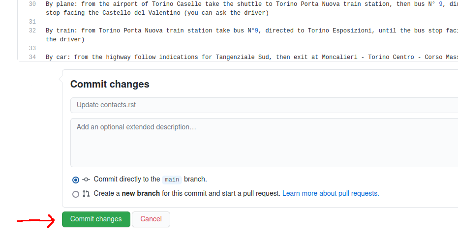

* Per ritornare alla pagina iniziale con l'elenco dei file premere il link **pages**

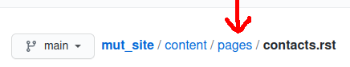

Edizione di un file .rst (sito web versione italiana)
~~~~~~~~~~~~~~~~~~~~~~~~~~~~~~~~~~~~~~~~~~~~~~~~~~~~~~~~~~~~~~~~~~~~~~~

Per l'edizione delle pagine del sito web in italiano procedere come sopra modificando i file presenti nella cartella
**mut_site** / **content** / **pages** / **it**

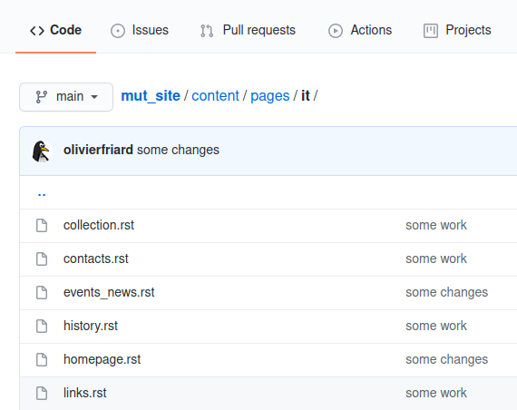

I file devono avere lo stesso nome di quelli della versione inglese.

Inserire una immagine
~~~~~~~~~~~~~~~~~~~~~~~~~~~~~~~~~~~~~~~~~~

* Aprire la cartella **mut_site** / **content** / **images**

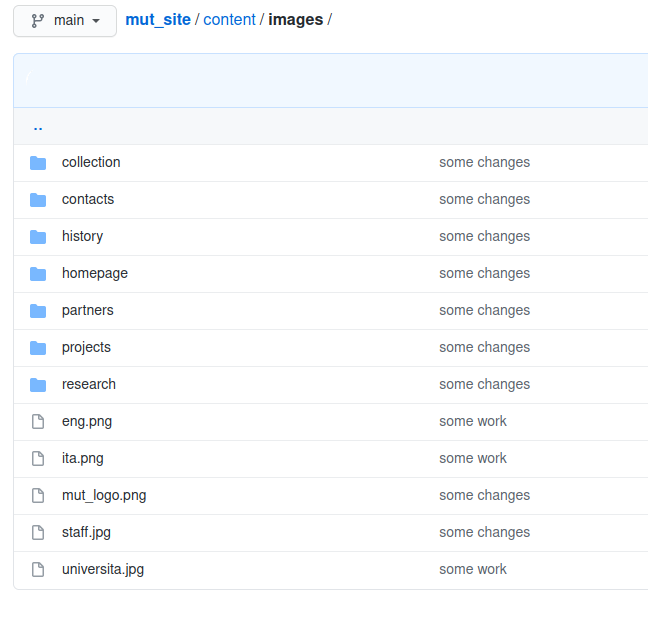

* Aprire la cartella corrispondente alla pagina desiderata. Ad esempio la cartella **contacts**

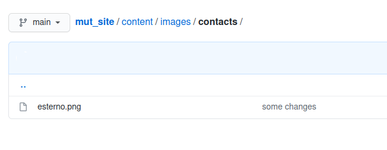

In questa cartella è presente una sola immagine **esterno.png**

* Aggiungere una nuova immagine cliccando sul pulsante **Add file > Upload files**

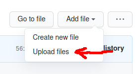

* Procedere all'upload del file contenente la nuova immagine.

* Premere il pulsante verde **Commit changes** in fondo alla pagina.

Il nuovo file compare nell'elenco dei file:

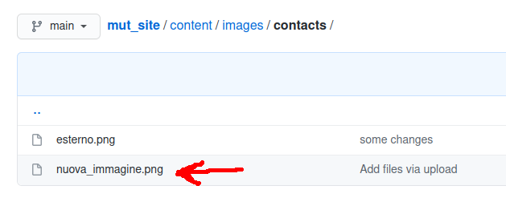

* Per aggiungere l'immagine sulla pagina ritornare all'edizione del file **contacts.rst** (vedere il capitolo **Edizione di un file .rst**):

* Inserire il codice seguente nel testo dove si vuole inserire la nuova immagine:

.. code-block:: plain

   .. image:: {static}/images/contacts/nuova_immagine.png
    :alt: vista dell'ortobotanico
    :align: center

dove:

* **nuova_immagine.png** è il nome del file contenente l'immagine

* **center** è la posizione dell'immagine nella pagina (i valori permessi sono: left, center, right)

* **vista dell'ortobotanico** è la descrizione dell'immagine per l'accessibilità

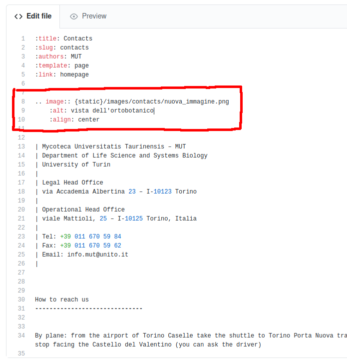

* Premere il pulsante verde **Commit changes** in fondo alla pagina.

Generazione del sito
-----------------------------------------------------------------------------

* Per rigenerare il sito collegarsi alla pagina `www.tucc-database.unito.it <https://www.tucc-database.unito.it>`_

Generazione del sito di test (DEV)
~~~~~~~~~~~~~~~~~~~~~~~~~~~~~~~~~~~~~~~~~~~

* Menù **Admin** > **Update DEV MUT site**

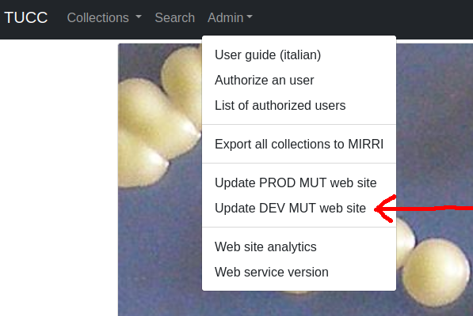

Se il sito è stato correttamente generato comparirà un messaggio con sfondo **verde**:

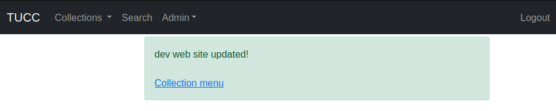

Nel caso contrario verrà riportato un elenco di errori su sfondo **rosso**

Verificare che il sito di test generato non comporti errori collegandosi alla pagina `http://www.tucc-database.unito.it:8080/new_mut <http://www.tucc-database.unito.it:8080/new_mut>`_

Se il sito non comporta errori, procedere con la generazione del sito.

Generazione del sito
~~~~~~~~~~~~~~~~~~~~~~~~~~~~~~~~~~~~~~~~~~~

* Menù **Admin** > **Update PROD MUT site**

I messaggi sono identici a quelli della generazione del sito di test (DEV).

