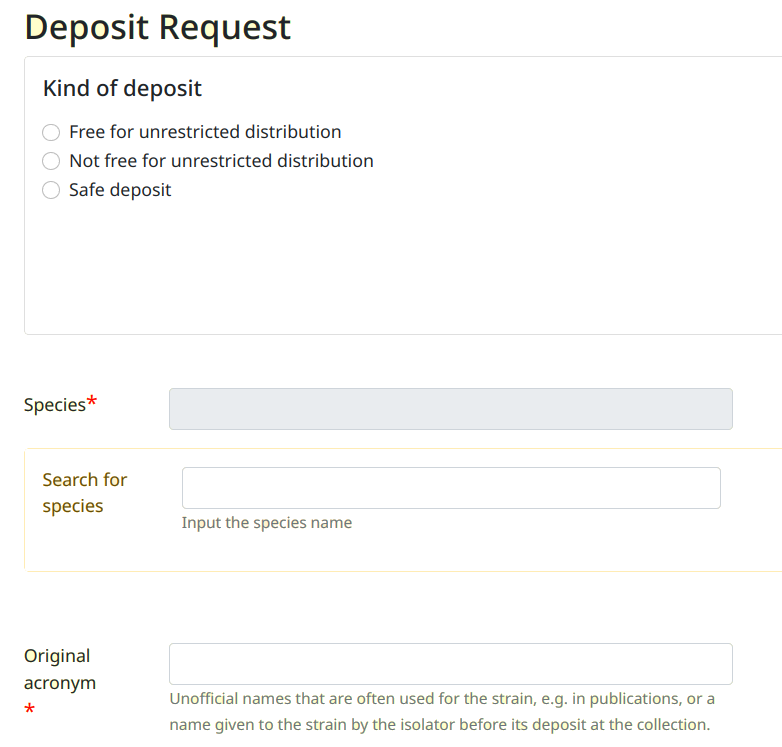
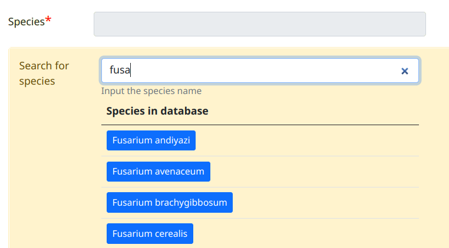
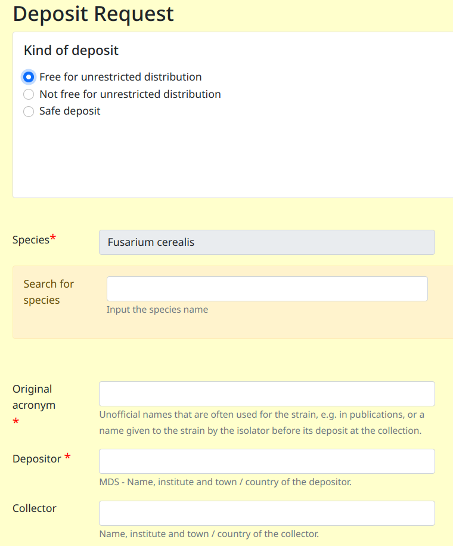
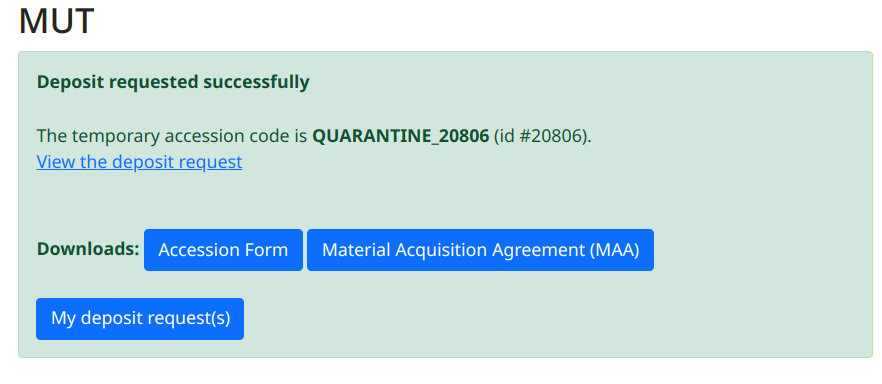

> Selezionare la collezione e clickare sul menù **Deposit a strain**

Scelta del tipo di deposito
---------------------------------

Selezione della specie
---------------------------------

Digitare l'inizio del nome della specie nella casella **Search for species** (con sfondo giallo).
Quindi selezionare la specie corretta cliccando sul pulsante blu 

Compilazione dei campi
---------------------------------

Compilare i campi. I campi contrasegnati con una stellina rossa sono obbligatori

Al termine premere il pulsante **Submit**
Verrà visualizzata la schermata seguente confermando la richiesta di deposito.

L'elenco di tutte le richieste di deposito è disponibile cliccando sul menù **My deposit request(s)**

I dati del ceppo con deposito richiesto possono essere modificati:

* Menù **My deposit request(s)** 

* Click sul codice d'accesso provvisorio (QUARANTENA_XXXXX)

* Pulsante **edit**

Aggiunta di una sequenza
-----------------------------------

* Menù **My deposit request(s)** 

* Click sul codice d'accesso provvisorio (QUARANTENA_XXXXX)

* Pulsante **Sequences**

Riferirsi al capitolo `Sequences`_

Aggiunta di una genoma
-----------------------------------

* Menù **My deposit request(s)** 

* Click sul codice d'accesso provvisorio (QUARANTENA_XXXXX)

* Pulsante **Genomes**

Riferirsi al capitolo `Genomes`_

Aggiunta di documenti
-----------------------------------

* Menù **My deposit request(s)** 

* Click sul codice d'accesso provvisorio (QUARANTENA_XXXXX)

* Pulsante **Associated documents**

Riferirsi al capitolo `Documents`_

Aggiunta di letteratura
-----------------------------------

* Menù **My deposit request(s)** 

* Click sul codice d'accesso provvisorio (QUARANTENA_XXXXX)

* Pulsante **Literature**

Riferirsi al capitolo `Literature`_