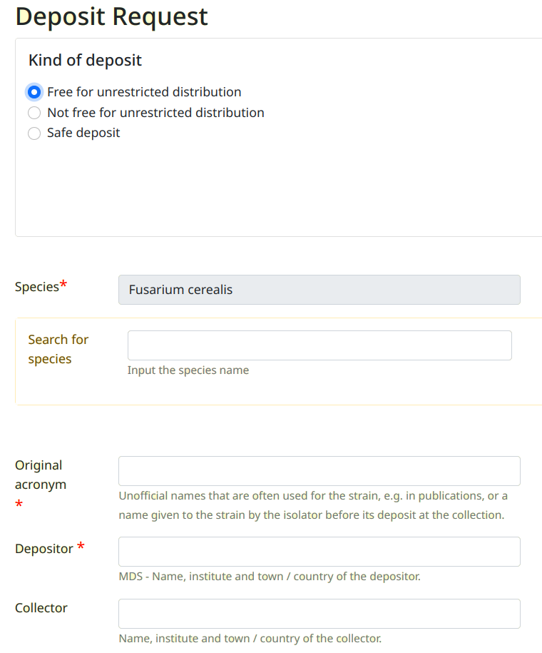

> Selezionare la collezione e cliccare sul menù **Deposit a strain**

.. image:: images/deposit_request.png
    :alt: Richiesta di deposito
    :width: 12cm

Scelta del tipo di deposito
---------------------------------

Scegliere tra le 3 opzioni proposte

Selezione della specie
---------------------------------

Digitare l'inizio del nome della specie nella casella **Search for species** (con sfondo giallo).
Quindi selezionare la specie corretta cliccando sul pulsante blu 

.. image:: images/deposit_request2.png
    :alt: Ricerca specie
    :width: 12cm

Se la specie **non fosse disponibile** nell'elenco dovrà essere creata seguendo la procedura:

* Menù **Create a new species**

* Inserire le informazioni nei vari campi

* Premere il pulsante **Save**

La specie creata sarà aggiunta alle specie in quarantena e risulterà selezionabile per la richiesta di deposito.

Compilazione dei campi
---------------------------------

Compilare i campi. I campi contrasegnati con una stellina rossa sono obbligatori

Al termine premere il pulsante **Submit** (a destra in basso).

Verrà visualizzata la schermata di conferma della richiesta di deposito.

.. image:: images/deposit_request4.png
    :alt: Conferma richiesta di deposito
    :width: 12cm

2 documenti precompilati possono essere scaricati:

* Accession form

* Material Acquisition Agreement (MAA)

L'elenco di tutte le richieste di deposito è disponibile cliccando sul menù **My deposit request(s)**

I dati del ceppo con deposito richiesto possono essere modificati:

* Menù **My deposit request(s)** 

* Click sul codice d'accesso provvisorio (QUARANTENA_XXXXX)

* Pulsante **edit**

Aggiunta di una sequenza
-----------------------------------

* Menù **My deposit request(s)** 

* Click sul codice d'accesso provvisorio (QUARANTENA_XXXXX)

* Pulsante **Sequences**

Riferirsi al capitolo `Sequences`_

Aggiunta di una genoma
-----------------------------------

* Menù **My deposit request(s)** 

* Click sul codice d'accesso provvisorio (QUARANTENA_XXXXX)

* Pulsante **Genomes**

Riferirsi al capitolo `Genomes`_

Aggiunta di documenti
-----------------------------------

* Menù **My deposit request(s)** 

* Click sul codice d'accesso provvisorio (QUARANTENA_XXXXX)

* Pulsante **Associated documents**

Riferirsi al capitolo `Documents`_

Aggiunta di letteratura
-----------------------------------

* Menù **My deposit request(s)** 

* Click sul codice d'accesso provvisorio (QUARANTENA_XXXXX)

* Pulsante **Literature**

Riferirsi al capitolo `Literature`_