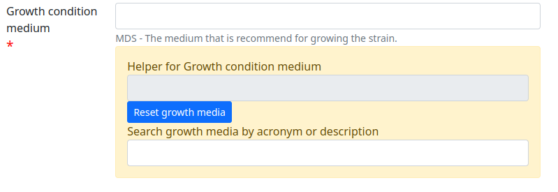
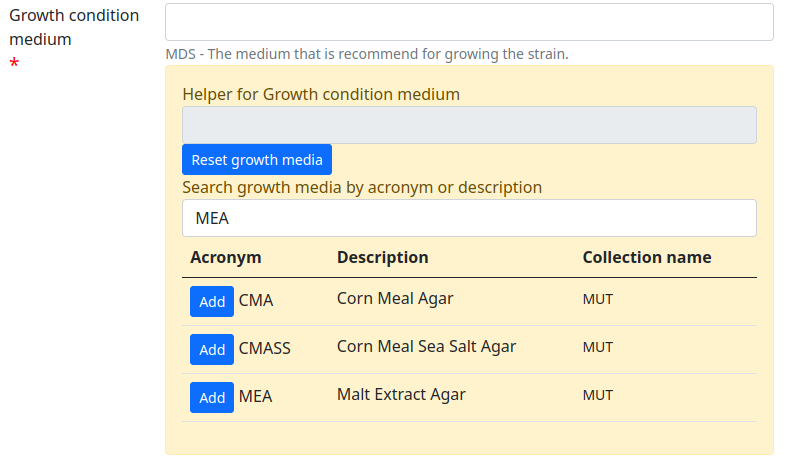
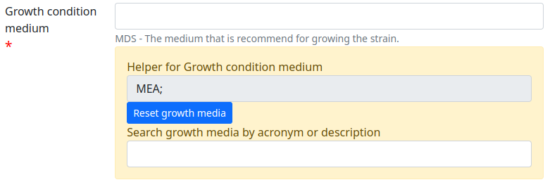
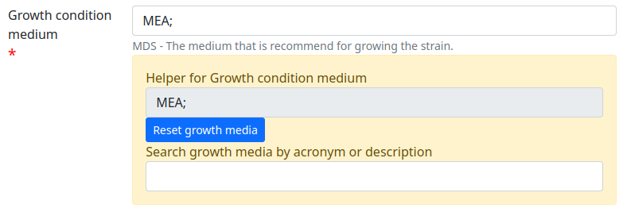

Di seguito sono elencati i vari campi della tabella ceppi del database:

- **Indice del campo** è un valore ad uso interno, non interessa l'utente che carica i dati dei ceppi

- **tipo di campo** indica il tipo di valore atteso

- **campo automatico** (Y/N) se questo valore è impostato a Y il campo non sarà visibile all'utente.

- **Minimum data Set** (Y/N) se questo valore è impostato a Y il campo è inserito nel Minimum Data Set.

Accession Number
----------------------------------------------------------------------------------

indice del campo: 1

Tipo di campo: text

campo automatico: Y

Minimum Data Set: N

Il sistema attribuisce un codice d'accesso costituito da **TUCC** seguito da 8 ciffra in ordine progressivo.
Un codice d'accesso già attribuito non sarà più reattribuito anche in caso di cappo cancellato o morto.

Per la collezione **MUT** il codice d'accesso comincia con la stringa **MUT**

Accession Date
----------------------------------------------------------------------------------

indice del campo: 2

Tipo di campo: date

valori autorizzati: Gli unici formati di date accettati sono **AAAA-MM-GG**, **AAAA-MM** o **AAAA**

campo automatico: Y

Minimum Data Set: N

Campo obbligatorio: N

\N

Genus
----------------------------------------------------------------------------------

indice del campo: 8

Tipo di campo: text

valori autorizzati:

campo automatico: N

Minimum Data Set: Y

Campo obbligatorio: N

Descrizione del campo:MDS

Specific epithet
----------------------------------------------------------------------------------

indice del campo: 9

Tipo di campo: text

campo automatico: N

Minimum Data Set: Y

Campo obbligatorio: N

Descrizione del campo:

Varietas / Formae Specialis
----------------------------------------------------------------------------------

indice del campo: 10

Tipo di campo: text

campo automatico: N

Minimum Data Set: N

Campo obbligatorio: N

Phylum
----------------------------------------------------------------------------------

indice del campo: 60

Tipo di campo: text

campo automatico: N

Minimum Data Set: N

Campo obbligatorio: N

Class
----------------------------------------------------------------------------------

indice del campo: 69

Tipo di campo: text

valori autorizzati:

campo automatico: N

Minimum Data Set: N

Campo obbligatorio: N

Order
----------------------------------------------------------------------------------

indice del campo: 70

Tipo di campo: text

valori autorizzati:

campo automatico: N

Minimum Data Set: N

Campo obbligatorio: N

Family
----------------------------------------------------------------------------------

indice del campo: 71

Tipo di campo: text

campo automatico: N

Minimum Data Set: N

Campo obbligatorio: N

Organism type
----------------------------------------------------------------------------------

indice del campo: 73

Tipo di campo: select

valori autorizzati: **Not known** **Fungus** **Yeast** **Bacterium** **Alga** **Archaea** **Cyanobacteria** **Phage** **Virus** **Plasmid**

campo automatico: N

Minimum Data Set: Y

Campo obbligatorio: N

Descrizione del campo:

Author
----------------------------------------------------------------------------------

indice del campo: 11

Tipo di campo: text

valori autorizzati:

campo automatico: N

Minimum Data Set: N

Campo obbligatorio: N

Descrizione del campo:

Original acronym
----------------------------------------------------------------------------------

indice del campo: 44

Tipo di campo: text

campo automatico: N

Minimum Data Set: N

Campo obbligatorio: Y

Descrizione del campo: Unofficial names that are often used for the strain, e.g. in publications, or a name given to the strain by the isolator before its deposit at the collection.

Depositor
----------------------------------------------------------------------------------

indice del campo: 39

Tipo di campo: text

campo automatico: N

Minimum Data Set: Y

Campo obbligatorio: Y

Descrizione del campo: Name, institute and town / country of the depositor.

Collector
----------------------------------------------------------------------------------

indice del campo: 37

Tipo di campo: text

campo automatico: N

Minimum Data Set: N

Campo obbligatorio: N

Descrizione del campo: Name, institute and town / country of the collector.

Date of collection
----------------------------------------------------------------------------------

indice del campo: 38

Tipo di campo: date

valori autorizzati: Gli unici formati di date accettati sono **AAAA-MM-GG**, **AAAA-MM** o **AAAA**

campo automatico: N

Minimum Data Set: N

Campo obbligatorio: Y

Descrizione del campo: Date when the sample was collected.  Allowed formats: YYYY, YYYY-MM, YYYY-MM-DD

Isolator
----------------------------------------------------------------------------------

indice del campo: 31

Tipo di campo: text

campo automatico: N

Minimum Data Set: N

Campo obbligatorio: N

Descrizione del campo: Name, institute and town / country of the isolator.

Date of isolation
----------------------------------------------------------------------------------

indice del campo: 32

Tipo di campo: date

valori autorizzati: Gli unici formati di date accettati sono **AAAA-MM-GG**, **AAAA-MM** o **AAAA**

campo automatico: N

Minimum Data Set: N

Campo obbligatorio: N

Original substrate
----------------------------------------------------------------------------------

indice del campo: 33

Tipo di campo: text

campo automatico: N

Minimum Data Set: N

Campo obbligatorio: N

Descrizione del campo: Information about the substrate and the host of isolation of the strain. It may include the detailed substrate from which the strain was isolated and the name of host plant/animal.

Isolation method
----------------------------------------------------------------------------------

indice del campo: 41

Tipo di campo: text

campo automatico: N

Minimum Data Set: N

Campo obbligatorio: N

Descrizione del campo:

Habitat (ecological data)
----------------------------------------------------------------------------------

indice del campo: 34

Tipo di campo: text

campo automatico: N

Minimum Data Set: N

Campo obbligatorio: N

Descrizione del campo: Information about the biotope where the species was found. It should include environmental physical factors, such as humidity, range of temperature, pH and light intensity, as well as biotic factors, such as the\
availability of food and the presence or absence of predators. It may also include information already specified in the related fields Geographic origin, Geographic origin coordinates and Altitude.

Geographical origin (country, province, place)
----------------------------------------------------------------------------------

indice del campo: 35

Tipo di campo: text

campo automatico: N

Minimum Data Set: Y

Campo obbligatorio: N

Descrizione del campo:

GPS coordinates
----------------------------------------------------------------------------------

indice del campo: 36

Tipo di campo: text

campo automatico: N

Minimum Data Set: N

Campo obbligatorio: N

Descrizione del campo:

Questo campo è presente per motivi di retrocompatibilità con il database MUT.
NON deve essere compilato.

Latitude (decimal)
----------------------------------------------------------------------------------

indice del campo: 101

Tipo di campo: numero a virgola

campo automatico: N

Minimum Data Set: N

Campo obbligatorio: N

Usare il punto (.) come separatore decimale

Esempio di valori validi:

* 45.45
* -20.9

Longitude (decimal)
----------------------------------------------------------------------------------

indice del campo: 100

Tipo di campo: numero a virgola

campo automatico: N

Minimum Data Set: N

Campo obbligatorio: N

Usare il punto (.) come separatore decimale

Esempio di valori validi:

* 7.45
* -20.9

Altitude (m)
----------------------------------------------------------------------------------

indice del campo: 103

Tipo di campo: numnero intero positivo o negativo

campo automatico: N

Minimum Data Set: N

Campo obbligatorio: N

Esempi di valori validi:

* 2890
* 1550
* -15

Continent
----------------------------------------------------------------------------------

indice del campo: 105

Tipo di campo: select

valori autorizzati: **Not known** **Africa** **Antartica** **Asia** **Europe** **North America** **Oceania** **South America**

campo automatico: N

Minimum Data Set: N

Campo obbligatorio: Y

Questo campo è compilato automaticamente quando l'utente clicca sulla mappa. Può esssere sovrascitto in caso di errore

Country
----------------------------------------------------------------------------------

indice del campo: 106

Tipo di campo: text

campo automatico: N

Minimum Data Set: N

Campo obbligatorio: Y

Questo campo è compilato automaticamente quando l'utente clicca sulla mappa. Può esssere sovrascitto in caso di errore

State
----------------------------------------------------------------------------------

indice del campo: 107

Tipo di campo: text

campo automatico: N

Minimum Data Set: N

Campo obbligatorio: Y

Descrizione del campo: State or region

Questo campo è compilato automaticamente quando l'utente clicca sulla mappa. Può esssere sovrascitto in caso di errore

Town
----------------------------------------------------------------------------------

indice del campo: 108

Tipo di campo: text

campo automatico: N

Minimum Data Set: N

Campo obbligatorio: Y

Questo campo è compilato automaticamente quando l'utente clicca sulla mappa. Può esssere sovrascitto in caso di errore

Place
----------------------------------------------------------------------------------

indice del campo: 109

Tipo di campo: text

campo automatico: N

Minimum Data Set: N

Campo obbligatorio: N

Questo campo è compilato automaticamente quando l'utente clicca sulla mappa. Può esssere sovrascitto in caso di errore

Received from (if not name of collector or isolator)
----------------------------------------------------------------------------------

indice del campo: 43

Tipo di campo: text

campo automatico: N

Minimum Data Set: N

Campo obbligatorio: N

Indicare il nome, il cognome, l'istituto (se presente), il comune e paese.

Identified by
----------------------------------------------------------------------------------

indice del campo: 40

Tipo di campo: text

campo automatico: N

Minimum Data Set: N

Campo obbligatorio: N

Indicare il nome, il cognome, l'istituto (se presente), il comune e paese.

Location of herbarum specimen
----------------------------------------------------------------------------------

indice del campo: 42

Tipo di campo: text

campo automatico: N

Minimum Data Set: N

Campo obbligatorio: N

Growth condition medium
----------------------------------------------------------------------------------

indice del campo: 47

Tipo di campo: text

valori autorizzati:

campo automatico: N

Minimum Data Set: Y

Campo obbligatorio: Y

Descrizione del campo: The medium that is recommend for growing the strain.

Indicare il mezzo colturale raccomandato per la crescita del ceppo

L'immissione del o dei terreni di coltura può essere eseguita cercando il terreno di coltura per acronimo o parte della descrizione nel quadro giallo:

* digitare l'acronimo del terreno (ad esempio MEA) nel campo **Search growth media by acronym or description**

* Premere il pulsante **Add** corrispondente al terreno desiderato

* reiterare eventualmente la ricerca per un altro terreno
* Alla fine della ricerca copiare il contenuto del campo **Helper for Growth condition medium** nel campo **Growth condition medium**
  

Il campo **Helper for Growth condition medium** può essere resettato con il pulsante **Reset growth media**

Growth condition temperature
----------------------------------------------------------------------------------

indice del campo: 48

Tipo di campo: numero a virgola

campo automatico: N

Minimum Data Set: Y

Campo obbligatorio: Y

Descrizione del campo:- The recommended growing temperature for the strain. Example: 24

Indicare la temperatura raccomandata per la crescita del ceppo in gradi Celsius.
Usare il punto (.) come separatore decimale. Non immetere l'unità.

Esempi di valori validi:

* 25
* 37.5

Sexual sporulation condition medium
----------------------------------------------------------------------------------

indice del campo: 49

Tipo di campo: text

campo automatico: N

Minimum Data Set: N

Campo obbligatorio: N

Sexual sporulation condition temperature
----------------------------------------------------------------------------------

indice del campo: 50

Tipo di campo: text

valori autorizzati:

campo automatico: N

Minimum Data Set: N

Campo obbligatorio: N

Usare il punto (.) come separatore decimale. Non immetere l'unità.

Esempi di valori validi:

* 25
* 37.5

Mating type
----------------------------------------------------------------------------------

indice del campo: 51

Tipo di campo: text

campo automatico: N

Minimum Data Set: N

Campo obbligatorio: N

Self sporulation
----------------------------------------------------------------------------------

indice del campo: 52

Tipo di campo: select

valori autorizzati: **Not known** **Yes** **No**

campo automatico: N

Minimum Data Set: N

Campo obbligatorio: N

Known method of preservation
----------------------------------------------------------------------------------

indice del campo: 15

Tipo di campo: multiselect

valori autorizzati: **Lyophilisation** **Cryopreservation** **Agar** **Water** **Oil** **Other**

campo automatico: N

Minimum Data Set: N

Campo obbligatorio: N

Patented strain
----------------------------------------------------------------------------------

indice del campo: 55

Tipo di campo: select

valori autorizzati:

* Not known
* Yes
* No

campo automatico: N

Minimum Data Set: N

Campo obbligatorio: Y

Indicare se il ceppo è protetto da brevetto.

Patent number
----------------------------------------------------------------------------------

indice del campo: 85

Tipo di campo: text

campo automatico: N

Minimum Data Set: N

Campo obbligatorio: N

Se il ceppo è protetto da brevetto indicare il numero del brevetto

Type strain
----------------------------------------------------------------------------------

indice del campo: 3

Tipo di campo: select

valori autorizzati:

* No
* Holotype
* Isotype
* Lectotype
* Sintype
* Neotype
* Epitype
* Paratype

campo automatico: N

Minimum Data Set: Y

Campo obbligatorio: Y

Descrizione del campo:

Deposited in other collection
----------------------------------------------------------------------------------

indice del campo: 23

Tipo di campo: select

valori autorizzati:

* Not known
* Yes
* No

campo automatico: N

Minimum Data Set: Y

Campo obbligatorio: Y

Descrizione del campo:

Indicare se il ceppo è stato depositato in una altra collezione

Collection and number
----------------------------------------------------------------------------------

indice del campo: 83

Tipo di campo: text

campo automatico: N

Minimum Data Set: N

Campo obbligatorio: N

Se il ceppo è stato depositato in una altra collezione indicare la collezione e il codice d'accesso del ceppo.

Additional Data
----------------------------------------------------------------------------------

indice del campo: 96

Tipo di campo: textarea

campo automatico: N

Minimum Data Set: N

Campo obbligatorio: N

Pathogenicity risk for animals and humans
----------------------------------------------------------------------------------

indice del campo: 4

Tipo di campo: select

valori autorizzati:

* Not known
* H0
* H1
* H2
* H3

campo automatico: N

Minimum Data Set: N

Campo obbligatorio: N

Pathogenic for species
----------------------------------------------------------------------------------

indice del campo: 80

Tipo di campo: textarea

campo automatico: N

Minimum Data Set: N

Campo obbligatorio: N

Se il ceppo è patogeno per animali e/o umani indicare le specie seprate da virgola.

Safety level
----------------------------------------------------------------------------------

indice del campo: 21

Tipo di campo: select

valori autorizzati:

* Not known
* BSL-1
* BSL-2
* BSL-3

campo automatico: N

Minimum Data Set: N

Campo obbligatorio: N

Precaution required
----------------------------------------------------------------------------------

indice del campo: 22

Tipo di campo: textarea

campo automatico: N

Minimum Data Set: N

Campo obbligatorio: N

Pathogenicity for vegetals
----------------------------------------------------------------------------------

indice del campo: 5

Tipo di campo: select

valori autorizzati:

* Not known
* P0
* P1
* P2
* P3

campo automatico: N

Minimum Data Set: N

Campo obbligatorio: N

Phytopathogenic for species
----------------------------------------------------------------------------------

indice del campo: 81

Tipo di campo: textarea

valori autorizzati:

campo automatico: N

Minimum Data Set: N

Campo obbligatorio: N

Se il ceppo è patogeno per vegetali indicare le specie seprate da virgola.

Toxins production
----------------------------------------------------------------------------------

indice del campo: 6

Tipo di campo: select

valori autorizzati:

* Not known
* T0
* T1
* T2
* T3

campo automatico: N

Minimum Data Set: N

Campo obbligatorio: N

Specify toxins
----------------------------------------------------------------------------------

indice del campo: 79

Tipo di campo: textarea

campo automatico: N

Minimum Data Set: N

Campo obbligatorio: N

Se il ceppo produce tossine indicare quali separate da virgola.

Hallucinogenic toxins
----------------------------------------------------------------------------------

indice del campo: 62

Tipo di campo: select

valori autorizzati: **Not known** **Yes** **No**

campo automatico: N

Minimum Data Set: N

Campo obbligatorio: N

Specify hallucinogenic
----------------------------------------------------------------------------------

indice del campo: 63

Tipo di campo: text

valori autorizzati:

campo automatico: N

Minimum Data Set: N

Campo obbligatorio: N

Se il ceppo produce tossine allucinogene indicare quali separate da virgola.

Quarantine condition
----------------------------------------------------------------------------------

indice del campo: 13

Tipo di campo: select

valori autorizzati: **Not known** **Yes** **No**

campo automatico: N

Minimum Data Set: N

Campo obbligatorio: Y

Descrizione del campo: Specify whether the strain is subject to quarantine according to European Directive 2000/29/CE and its amendments and corrections. The list of quarantine organisms is available in the Commission Implementing Regulation (EU) 2019/2072.

Specify legislation for quarantine
----------------------------------------------------------------------------------

indice del campo: 86

Tipo di campo: text

campo automatico: N

Minimum Data Set: N

Campo obbligatorio: N

Dual use organism
----------------------------------------------------------------------------------

indice del campo: 12

Tipo di campo: select

valori autorizzati: **Not known** **Yes** **No**

campo automatico: N

Minimum Data Set: N

Campo obbligatorio: Y

Descrizione del campo: Specify whether the strain has the potential for a harmful use according to EU Council Regulation 2000/1334/CE and its amendments and corrections.

Specify legislation for dual use
----------------------------------------------------------------------------------

indice del campo: 87

Tipo di campo: text

valori autorizzati:

campo automatico: N

Minimum Data Set: N

Campo obbligatorio: N

Biological interactions
----------------------------------------------------------------------------------

indice del campo: 46

Tipo di campo: textarea

campo automatico: N

Minimum Data Set: N

Campo obbligatorio: N

Properties-Application
----------------------------------------------------------------------------------

indice del campo: 45

Tipo di campo: textarea

campo automatico: N

Minimum Data Set: N

Campo obbligatorio: N

Descrizione del campo: Information about applications of the strain.

Contains plasmides
----------------------------------------------------------------------------------

indice del campo: 56

Tipo di campo: select

valori autorizzati: **Not known** **Yes** **No**

campo automatico: N

Minimum Data Set: N

Campo obbligatorio: N

Specify plasmides
----------------------------------------------------------------------------------

indice del campo: 82

Tipo di campo: textarea

campo automatico: N

Minimum Data Set: N

Campo obbligatorio: N

Descrizione del campo: Information about plasmids in the strain. It may include plasmid name and type (original plasmid, cloning vehicle, recombinant plasmid), restriction sites, relevant genes (e.g., origin of replication, transposons, promoters, terminators, structural genes).

Se il ceppo contiene plasmidi indicare quali

Genetically modified
----------------------------------------------------------------------------------

indice del campo: 57

Tipo di campo: select

valori autorizzati: **Not known** **Yes** **No**

campo automatico: N

Minimum Data Set: N

Campo obbligatorio: N

Specify modifications
----------------------------------------------------------------------------------

indice del campo: 90

Tipo di campo: textarea

valori autorizzati:

campo automatico: N

Minimum Data Set: N

Campo obbligatorio: N

Se il ceppo è stato geneticamente modificato indicare quali modifiche.

Kind of deposit
----------------------------------------------------------------------------------

indice del campo: 7

Tipo di campo: select

valori autorizzati: **Safe deposit** **Free for unrestricted distribution** **Not free for unrestricted distribution**

campo automatico: N

Minimum Data Set: Y

Campo obbligatorio: Y

Descrizione del campo:

Specify restriction for deposit
----------------------------------------------------------------------------------

indice del campo: 68

Tipo di campo: textarea

campo automatico: N

Minimum Data Set: N

Campo obbligatorio: N

Condition
----------------------------------------------------------------------------------

indice del campo: 14

Tipo di campo: select

valori autorizzati: **Not known** **Alive** **Dead**

campo automatico: N

Minimum Data Set: N

Campo obbligatorio: N

Mode of preservation
----------------------------------------------------------------------------------

indice del campo: 16

Tipo di campo: multiselect

valori autorizzati: **Lyophilisation** **Cryopreservation** **Agar** **Water** **Oil** **Other**

campo automatico: N

Minimum Data Set: N

Campo obbligatorio: N

Date of lyophilization
----------------------------------------------------------------------------------

indice del campo: 29

Tipo di campo: date

valori autorizzati: Gli unici formati di date accettati sono **AAAA-MM-GG**, **AAAA-MM** o **AAAA**

campo automatico: N

Minimum Data Set: N

Campo obbligatorio: N

Descrizione del campo:Allowed formats: YYYY, YYYY-MM, YYYY-MM-DD

Tube number of lyophilized
----------------------------------------------------------------------------------

indice del campo: 164

Tipo di campo: numero intero

campo automatico: N

Minimum Data Set: N

Campo obbligatorio: N

Descrizione del campo: Number of tubes of the lyophilized strain

Localisation of lyophilized
----------------------------------------------------------------------------------

indice del campo: 17

Tipo di campo: text

campo automatico: N

Minimum Data Set: N

Campo obbligatorio: N

Date of cryopreservation -80
----------------------------------------------------------------------------------

indice del campo: 30

Tipo di campo: date

valori autorizzati: Gli unici formati di date accettati sono **AAAA-MM-GG**, **AAAA-MM** o **AAAA**

campo automatico: N

Minimum Data Set: N

Campo obbligatorio: N

Descrizione del campo:Allowed formats: YYYY, YYYY-MM, YYYY-MM-DD

Localisation cryopreserved -80
----------------------------------------------------------------------------------

indice del campo: 18

Tipo di campo: text

campo automatico: N

Minimum Data Set: N

Campo obbligatorio: N

Tube number -80
----------------------------------------------------------------------------------

indice del campo: 167

Tipo di campo: numero intero

campo automatico: N

Minimum Data Set: N

Campo obbligatorio: N

Date of cryopreservation -152
----------------------------------------------------------------------------------

indice del campo: 165

Tipo di campo: date

valori autorizzati: Gli unici formati di date accettati sono **AAAA-MM-GG**, **AAAA-MM** o **AAAA**

campo automatico: N

Minimum Data Set: N

Campo obbligatorio: N

Descrizione del campo:Allowed formats: YYYY, YYYY-MM, YYYY-MM-DD

Localisation cryopreserved -152
----------------------------------------------------------------------------------

indice del campo: 166

Tipo di campo: text

campo automatico: N

Minimum Data Set: N

Campo obbligatorio: N

Tube number -152
----------------------------------------------------------------------------------

indice del campo: 168

Tipo di campo: numero intero

campo automatico: N

Minimum Data Set: N

Campo obbligatorio: N

Last transfert
----------------------------------------------------------------------------------

indice del campo: 27

Tipo di campo: date

valori autorizzati: Gli unici formati di date accettati sono **AAAA-MM-GG**, **AAAA-MM** o **AAAA**

campo automatico: N

Minimum Data Set: N

Campo obbligatorio: N

Descrizione del campo:Allowed formats: YYYY, YYYY-MM, YYYY-MM-DD

AG specify
----------------------------------------------------------------------------------

indice del campo: 88

Tipo di campo: textarea

valori autorizzati:

campo automatico: N

Minimum Data Set: N

Campo obbligatorio: N

\N

Last check
----------------------------------------------------------------------------------

indice del campo: 28

Tipo di campo: date

valori autorizzati: Gli unici formati di date accettati sono **AAAA-MM-GG**, **AAAA-MM** o **AAAA**

campo automatico: N

Minimum Data Set: N

Campo obbligatorio: N

Descrizione del campo:Allowed formats: YYYY, YYYY-MM, YYYY-MM-DD

Next transfert date
----------------------------------------------------------------------------------

indice del campo: 95

Tipo di campo: date

valori autorizzati: Gli unici formati di date accettati sono **AAAA-MM-GG**, **AAAA-MM** o **AAAA**

campo automatico: N

Minimum Data Set: N

Campo obbligatorio: N

Descrizione del campo:Allowed formats: YYYY, YYYY-MM, YYYY-MM-DD

Form of supply
----------------------------------------------------------------------------------

indice del campo: 19

Tipo di campo: text

valori autorizzati:

campo automatico: Y

Minimum Data Set: Y

Campo obbligatorio: N

Descrizione del campo:MDS

Restricted item
----------------------------------------------------------------------------------

indice del campo: 20

Tipo di campo: select

valori autorizzati: **Not known** **Yes** **No**

campo automatico: N

Minimum Data Set: N

Campo obbligatorio: N

\N

Specify restriction
----------------------------------------------------------------------------------

indice del campo: 89

Tipo di campo: textarea

valori autorizzati:

campo automatico: N

Minimum Data Set: N

Campo obbligatorio: N

\N

Additional data and General remarks
----------------------------------------------------------------------------------

indice del campo: 24

Tipo di campo: textarea

valori autorizzati:

campo automatico: N

Minimum Data Set: N

Campo obbligatorio: N

\N

MUT sequences
----------------------------------------------------------------------------------

indice del campo: 25

Tipo di campo: textarea

valori autorizzati:

campo automatico: N

Minimum Data Set: N

Campo obbligatorio: N

\N

Deposited MUT sequences
----------------------------------------------------------------------------------

indice del campo: 26

Tipo di campo: text

valori autorizzati:

campo automatico: N

Minimum Data Set: N

Campo obbligatorio: N

\N

Attached documents type
----------------------------------------------------------------------------------

indice del campo: 53

Tipo di campo: select

valori autorizzati: **Not known** **Yes** **No**

campo automatico: Y

Minimum Data Set: N

Campo obbligatorio: N

\N

Distribution
----------------------------------------------------------------------------------

indice del campo: 58

Tipo di campo: text

valori autorizzati:

campo automatico: N

Minimum Data Set: N

Campo obbligatorio: N

\N

MDS
----------------------------------------------------------------------------------

indice del campo: 97

Tipo di campo: text

valori autorizzati:

campo automatico: Y

Minimum Data Set: N

Campo obbligatorio: N

PIC
----------------------------------------------------------------------------------

indice del campo: 54

Tipo di campo: file

valori autorizzati:

campo automatico: Y

Minimum Data Set: N

Campo obbligatorio: Y

\N

MTA
----------------------------------------------------------------------------------

indice del campo: 74

Tipo di campo: file

valori autorizzati:

campo automatico: Y

Minimum Data Set: N

Campo obbligatorio: N

\N

MAA
----------------------------------------------------------------------------------

indice del campo: 75

Tipo di campo: file

valori autorizzati:

campo automatico: Y

Minimum Data Set: N

Campo obbligatorio: N

\N

Tossine
----------------------------------------------------------------------------------

indice del campo: 76

Tipo di campo: file

valori autorizzati:

campo automatico: N

Minimum Data Set: N

Campo obbligatorio: N

Patogeni
----------------------------------------------------------------------------------

indice del campo: 94

Tipo di campo: file

valori autorizzati:

campo automatico: N

Minimum Data Set: N

Campo obbligatorio: N

Other (1)
----------------------------------------------------------------------------------

indice del campo: 77

Tipo di campo: file

valori autorizzati:

campo automatico: N

Minimum Data Set: N

Campo obbligatorio: N

Other (2)
----------------------------------------------------------------------------------

indice del campo: 78

Tipo di campo: file

valori autorizzati:

campo automatico: N

Minimum Data Set: N

Campo obbligatorio: N

preservation_lyo
----------------------------------------------------------------------------------

indice del campo: 150

Tipo di campo: select

valori autorizzati: **Not known** **Yes** **No**

campo automatico: Y

Minimum Data Set: N

Campo obbligatorio: N

preservation_cryo
----------------------------------------------------------------------------------

indice del campo: 151

Tipo di campo: select

valori autorizzati: **Not known** **Yes** **No**

campo automatico: Y

Minimum Data Set: N

Campo obbligatorio: N

preservation_agar
----------------------------------------------------------------------------------

indice del campo: 152

Tipo di campo: select

valori autorizzati: **Not known** **Yes** **No**

campo automatico: Y

Minimum Data Set: N

Campo obbligatorio: N

preservation_water
----------------------------------------------------------------------------------

indice del campo: 153

Tipo di campo: select

valori autorizzati: **Not known** **Yes** **No**

campo automatico: Y

Minimum Data Set: N

Campo obbligatorio: N

preservation_oil
----------------------------------------------------------------------------------

indice del campo: 154

Tipo di campo: select

valori autorizzati: **Not known** **Yes** **No**

campo automatico: Y

Minimum Data Set: N

Campo obbligatorio: N

known_preservation_lyo
----------------------------------------------------------------------------------

indice del campo: 160

Tipo di campo: select

valori autorizzati: **Not known** **Yes** **No**

campo automatico: Y

Minimum Data Set: N

Campo obbligatorio: N

known_preservation_cryo
----------------------------------------------------------------------------------

indice del campo: 161

Tipo di campo: select

valori autorizzati: **Not known** **Yes** **No**

campo automatico: Y

Minimum Data Set: N

Campo obbligatorio: N

known_preservation_agar
----------------------------------------------------------------------------------

indice del campo: 162

Tipo di campo: select

valori autorizzati: **Not known** **Yes** **No**

campo automatico: Y

Minimum Data Set: N

Campo obbligatorio: N

known_preservation_water
----------------------------------------------------------------------------------

indice del campo: 163

Tipo di campo: select

valori autorizzati: **Not known** **Yes** **No**

campo automatico: Y

Minimum Data Set: N

Campo obbligatorio: N

Export to MIRRI
----------------------------------------------------------------------------------

indice del campo: 252

Tipo di campo: select

valori autorizzati:No|Yes

campo automatico: N

Minimum Data Set: N

Campo obbligatorio: N

Descrizione del campo:Export this record to MIRRI

MIRRI Other culture collection numbers
----------------------------------------------------------------------------------

indice del campo: 200

Tipo di campo: text

valori autorizzati:

campo automatico: Y

Minimum Data Set: N

Campo obbligatorio: N

Descrizione del campo: Accession numbers of the same strain in other CCs, when known.

Questo campo è compilato automaticamente con il contenuto del campo **Collection and number** (indice 83)

MIRRI Restrictions on use
----------------------------------------------------------------------------------

indice del campo: 201

Tipo di campo: select

valori autorizzati: **1:no restrictions apply** **2:for research only** **3:for commercial development a special agreement is requested**

campo automatico: N

Minimum Data Set: N

Campo obbligatorio: Y

Descrizione del campo: Report if the strain can be used for commercial development or not.

MIRRI Nagoya protocol compliance conditions
----------------------------------------------------------------------------------

indice del campo: 202

Tipo di campo: select

valori autorizzati:1: **Not known** **restrictions under the Nagoya protocol** **2:Documents providing proof of legal access and terms of use available at the collection** **3:Strain probably in scope, please contact the culture collection**

campo automatico: N

Minimum Data Set: N

Campo obbligatorio: Y

Descrizione del campo:Situation of the strain in relation to the Nagoya protocol.

MIRRI ABS related files
----------------------------------------------------------------------------------

indice del campo: 203

Tipo di campo: text

valori autorizzati:

campo automatico: Y

Minimum Data Set: N

Campo obbligatorio: N

MIRRI MTA file
----------------------------------------------------------------------------------

indice del campo: 204

Tipo di campo: text

valori autorizzati:

campo automatico: Y

Minimum Data Set: N

Campo obbligatorio: N

MIRRI Strain from a Registered Collection
----------------------------------------------------------------------------------

indice del campo: 205

Tipo di campo: select

valori autorizzati: **1:No** **2:Yes**

campo automatico: N

Minimum Data Set: N

Campo obbligatorio: N

Descrizione del campo:Strain included in the registered CC according to the EU Regulation 511/2014. Unregistered CCs can omit this information.

MIRRI Risk Group
----------------------------------------------------------------------------------

indice del campo: 251

Tipo di campo: select

valori autorizzati: **1:1** **2:2** **3:3** **4:4**

campo automatico: Y

Minimum Data Set: N

Campo obbligatorio: Y

Descrizione del campo: Risk group according to EU Directive 2000/54/EC and its amendments and corrections.

Questo campo è compilato automaticamente con il valore del campo XXX

MIRRI Biosafety level
----------------------------------------------------------------------------------

indice del campo: 206

Tipo di campo: select

valori autorizzati: **1:BSL-1** **2:BSL-2** **3:BSL-3** **4:BSL-4**

campo automatico: Y

Minimum Data Set: N

Campo obbligatorio: N

Questo campo è compilato automaticamente con il valore del campo XXX

MIRRI Dual use
----------------------------------------------------------------------------------

indice del campo: 207

Tipo di campo: select

valori autorizzati: **1:No** **2:Yes**

campo automatico: Y

Minimum Data Set: N

Campo obbligatorio: N

Descrizione del campo: Specify whether the strain has the potential for a harmful use according to EU Council Regulation 2000/1334/CE and its amendments and corrections.

Questo campo è compilato automaticamente con il valore del campo XXX

MIRRI Quarantine in Europe
----------------------------------------------------------------------------------

indice del campo: 208

Tipo di campo: select

valori autorizzati: **1:No** **2:Yes**

campo automatico: Y

Minimum Data Set: N

Campo obbligatorio: N

Descrizione del campo: Specify whether the strain is subject to quarantine according to European Directive 2000/29/CE and its amendments and corrections. The list of quarantine organisms is available in the Commission Implementing Regulation (EU) 2019/2072.

Questo campo è compilato automaticamente con il valore del campo XXX

MIRRI Organism type
----------------------------------------------------------------------------------

indice del campo: 209

Tipo di campo: select

valori autorizzati:

* 1:Algae
* 2:Archaea
* 3:Bacteria
* 4:Cyanobacteria
* 5:Filamentous Fungi
* 6:Phage
* 7:Plasmid
* 8:Virus
* 9:Yeast

campo automatico: Y

Minimum Data Set: N

Campo obbligatorio: Y

Descrizione del campo:The type of the resource.

Questo campo è compilato automaticamente con il valore del campo XXX

MIRRI Taxon name
----------------------------------------------------------------------------------

indice del campo: 210

Tipo di campo: text

valori autorizzati:

campo automatico: Y

Minimum Data Set: N

Campo obbligatorio: Y

Descrizione del campo: Taxon name including genus, species and variant names, as taken from an authoritative nomenclature reference, including Mycobank for fungi and yeasts, the Prokaryotic Nomenclature Up-to-date for bacteria and archaea, AlgaeBase for algae and cyanobacteria, and ICVT for viruses.

Questo campo è compilato automaticamente con il valore del campo XXX

MIRRI Infrasubspecific names
----------------------------------------------------------------------------------

indice del campo: 211

Tipo di campo: text

valori autorizzati:

campo automatico: Y

Minimum Data Set: N

Campo obbligatorio: N

Descrizione del campo:Infrasubspecific names including biovar, chemovar, cultivar, morphovar, pathovar, phagovar, serovar, forma specialis, phase.

Questo campo è compilato automaticamente con il valore del campo XXX

MIRRI Comment on taxonomy
----------------------------------------------------------------------------------

indice del campo: 212

Tipo di campo: text

campo automatico: N

Minimum Data Set: N

Campo obbligatorio: N

Descrizione del campo: Any comment and/or note on the taxonomy of the strain. It may be used, e.g., for information on new species or revised nomenclatures. It must be used when the Taxon name data field includes a name that is not present in the nomenclature reference.

MIRRI Status
----------------------------------------------------------------------------------

indice del campo: 213

Tipo di campo: textarea

campo automatico: N

Minimum Data Set: N

Campo obbligatorio: N

Descrizione del campo: For type strains, specify their type (type, neotype, holotype, epitype, etc). A list of allowed values is not defined and this information can be provided as free text. Future improvements of the dataset will likely foresee a list of values.

MIRRI History of deposit
----------------------------------------------------------------------------------

indice del campo: 214

Tipo di campo: text

campo automatico: N

Minimum Data Set: N

Campo obbligatorio: N

Descrizione del campo: Transfers of the strain between isolation and deposit in the CC.

MIRRI Depositor
----------------------------------------------------------------------------------

indice del campo: 215

Tipo di campo: text

valori autorizzati:

campo automatico: Y

Minimum Data Set: N

Campo obbligatorio: N

Descrizione del campo:Name, institute and town / country of the depositor.

Questo campo è compilato automaticamente con il valore del campo XXX

MIRRI Date of deposit
----------------------------------------------------------------------------------

indice del campo: 216

Tipo di campo: date

valori autorizzati: Gli unici formati di date accettati sono **AAAA-MM-GG**, **AAAA-MM** o **AAAA**

campo automatico: N

Minimum Data Set: N

Campo obbligatorio: N

Descrizione del campo:Date when the strain was deposited at the CC (YYYY-MM-DD)

MIRRI Collected by
----------------------------------------------------------------------------------

indice del campo: 217

Tipo di campo: text

campo automatico: Y

Minimum Data Set: N

Campo obbligatorio: N

Descrizione del campo: Name, institute and town / country of the collector.

Questo campo è compilato automaticamente con il valore del campo XXX

MIRRI Date of collection
----------------------------------------------------------------------------------

indice del campo: 218

Tipo di campo: date

valori autorizzati: Gli unici formati di date accettati sono **AAAA-MM-GG**, **AAAA-MM** o **AAAA**

campo automatico: Y

Minimum Data Set: N

Campo obbligatorio: N

Descrizione del campo:Date when the sample was collected. (YYYY-MM-DD)

Questo campo è compilato automaticamente con il valore del campo XXX

MIRRI Isolated by
----------------------------------------------------------------------------------

indice del campo: 219

Tipo di campo: text

campo automatico: Y

Minimum Data Set: N

Campo obbligatorio: N

Descrizione del campo:Name, institute and town / country of the isolator.

Questo campo è compilato automaticamente con il valore del campo XXX

MIRRI Date of isolation
----------------------------------------------------------------------------------

indice del campo: 220

Tipo di campo: date

valori autorizzati: Gli unici formati di date accettati sono **AAAA-MM-GG**, **AAAA-MM** o **AAAA**

campo automatico: Y

Minimum Data Set: N

Campo obbligatorio: N

Descrizione del campo:Date when the strain was isolated from the sample. (YYYY-MM-DD)

Questo campo è compilato automaticamente con il valore del campo XXX

MIRRI Date of inclusion in the catalogue
----------------------------------------------------------------------------------

indice del campo: 221

Tipo di campo: date

valori autorizzati: Gli unici formati di date accettati sono **AAAA-MM-GG**, **AAAA-MM** o **AAAA**

campo automatico: N

Minimum Data Set: N

Campo obbligatorio: N

Descrizione del campo: Date when the strain was included in the catalog and/or an accession number was assigned to it.

MIRRI Tested temperature growth range
----------------------------------------------------------------------------------

indice del campo: 222

Tipo di campo: 2 valori decimali separati da un segno meno (-)

valori autorizzati:

campo automatico: N

Minimum Data Set: N

Campo obbligatorio: N

Descrizione del campo: The lowest and the highest temperature at which the strain was tested for growing. Example: 15;35

Usare il punto (.) come separatore decimale

Esempio di valori validi:

* 25-37.5
* 36-38

MIRRI Recommended growth temperature
----------------------------------------------------------------------------------

indice del campo: 223

Tipo di campo: numero a virgola

valori autorizzati:

campo automatico: Y

Minimum Data Set: N

Campo obbligatorio: Y

Descrizione del campo: The recommended growing temperature for the strain. Example: 24

Questo campo è compilato automaticamente con il valore del campo **Growth condition temperature**

MIRRI Recommended medium for growth
----------------------------------------------------------------------------------

indice del campo: 224

Tipo di campo: text

valori autorizzati:

campo automatico: Y

Minimum Data Set: N

Campo obbligatorio: Y

Descrizione del campo: The medium that is recommend for growing the strain.

L'immissione del o dei terreni di coltura può essere eseguita cercando il terreno di coltura per acronimo o parte della descrizione nel quadro giallo sottostante.
Vedere campo **Growth condition medium** per i dettagli

MIRRI Form of supply
----------------------------------------------------------------------------------

indice del campo: 225

Tipo di campo: multiselect

valori autorizzati:

* Agar
* Cryo
* Dry ice
* Liquid Culture Medium
* Lyo
* Oil
* Water

campo automatico: N

Minimum Data Set: N

Campo obbligatorio: Y

Descrizione del campo: The forms of supply of the strain to users.

MIRRI Other denomination
----------------------------------------------------------------------------------

indice del campo: 226

Tipo di campo: text

valori autorizzati:

campo automatico: Y

Minimum Data Set: N

Campo obbligatorio: N

Descrizione del campo: Unofficial names that are often used for the strain, e.g. in publications, or a name given to the strain by the isolator before its deposit at the collection.

Questo campo è compilato automaticamente con il valore del **acronym**

MIRRI Coordinates of geographic origin
----------------------------------------------------------------------------------

indice del campo: 227

Tipo di campo: 2 valori decimali separati da un punto virgola (;)

valori autorizzati:

campo automatico: Y

Minimum Data Set: N

Campo obbligatorio: N

Descrizione del campo: The geographic coordinates of the location where the sample was collected. (decimal coordinates)

Questo campo è compilato automaticamente con i valori dei campi **latitude** e **longitude**

MIRRI Altitude
----------------------------------------------------------------------------------

indice del campo: 228

Tipo di campo: numero intero positivo o negativo

campo automatico: Y

Minimum Data Set: N

Campo obbligatorio: N

Descrizione del campo: The altitude of the location where the sample was collected.

Questo campo è compilato automaticamente con il valore del campo **altitude**.

MIRRI Geographic origin
----------------------------------------------------------------------------------

indice del campo: 229

Tipo di campo: text

valori autorizzati:

campo automatico: Y

Minimum Data Set: N

Campo obbligatorio: Y

Descrizione del campo: The locality where the sample was collected, defined with the highest possible precision. Example: Altafjorden, Alta, Troms og Finnmark, Norway

Questo campo è compilato automaticamente con i valori dei campi **continent**, **country**, **state**, **town**, **place**.

MIRRI GMO
----------------------------------------------------------------------------------

indice del campo: 230

Tipo di campo: select

valori autorizzati:

* 0:Not known
* 1:No
* 2:Yes

campo automatico: Y

Minimum Data Set: N

Campo obbligatorio: N

Descrizione del campo: Specify whether the strain is a Genetically Modified Organism (GMO).

Questo campo è compilato automaticamente con il valore del campo **altitude**.

MIRRI GMO construction information
----------------------------------------------------------------------------------

indice del campo: 231

Tipo di campo: textarea

campo automatico: N

Minimum Data Set: N

Campo obbligatorio: N

Descrizione del campo:Information on the construction of the GMO.

MIRRI Mutant information
----------------------------------------------------------------------------------

indice del campo: 232

Tipo di campo: textarea

valori autorizzati:

campo automatico: N

Minimum Data Set: N

Campo obbligatorio: N

Descrizione del campo:Information on mutant strains.

MIRRI Genotype
----------------------------------------------------------------------------------

indice del campo: 233

Tipo di campo: textarea

valori autorizzati:

campo automatico: N

Minimum Data Set: N

Campo obbligatorio: N

Descrizione del campo:Information on the genotype of the strain.

MIRRI Literature
----------------------------------------------------------------------------------

indice del campo: 234

Tipo di campo: textarea

valori autorizzati:

campo automatico: Y

Minimum Data Set: N

Campo obbligatorio: N

Descrizione del campo:Information on literature linked to the identification and properties of the strain. Does not include literature related to the sequence of the strain. For publications indexed by Pubmed or having an official DOI number, collections should provide the relative identifiers, respectively PMIDs and DOIs.

MIRRI Sexual state
----------------------------------------------------------------------------------

indice del campo: 235

Tipo di campo: select

valori autorizzati:Not known|Mata|Matalpha|Mata/Matalpha|Mata|Matb|Mata/Matb|MTLa|MTLalpha|MTLa/MTLalpha|MAT1-1|MAT1-2|MAT1|MAT2

campo automatico: N

Minimum Data Set: N

Campo obbligatorio: N

Descrizione del campo:Information on strain sexual state / mating type, for relevant resource types.

MIRRI Ploidy
----------------------------------------------------------------------------------

indice del campo: 236

Tipo di campo: select

valori autorizzati:0:Aneuploid|1:Haploid|2:Diploid|3:Triploid|4:Tetraploid|9:Polyploid over 4n

campo automatico: N

Minimum Data Set: N

Campo obbligatorio: N

Descrizione del campo:Information on the ploidy level of the strain.

MIRRI Interspecific hybrid
----------------------------------------------------------------------------------

indice del campo: 237

Tipo di campo: select

valori autorizzati:0:Not known|1:No|2:Yes

campo automatico: N

Minimum Data Set: N

Campo obbligatorio: N

Descrizione del campo:This field reports whether the strain is an interspecific hybrid.

MIRRI Pathogenicity
----------------------------------------------------------------------------------

indice del campo: 239

Tipo di campo: textarea

valori autorizzati:

campo automatico: N

Minimum Data Set: N

Campo obbligatorio: N

Descrizione del campo:Information about pathogenicity of the strain for plants, humans and animals.\
Can include specification for the Belgian plant pathogenicity code.

MIRRI Enzyme production
----------------------------------------------------------------------------------

indice del campo: 240

Tipo di campo: textarea

valori autorizzati:

campo automatico: N

Minimum Data Set: N

Campo obbligatorio: N

Descrizione del campo:Information about enzyme production by the strain.

MIRRI Production of metabolites
----------------------------------------------------------------------------------

indice del campo: 241

Tipo di campo: textarea

valori autorizzati:

campo automatico: N

Minimum Data Set: N

Campo obbligatorio: N

Descrizione del campo:Information about metabolite production by the strain.

MIRRI Applications
----------------------------------------------------------------------------------

indice del campo: 242

Tipo di campo: textarea

valori autorizzati:

campo automatico: Y

Minimum Data Set: N

Campo obbligatorio: N

Descrizione del campo:Information about applications of the strain.

MIRRI Remarks
----------------------------------------------------------------------------------

indice del campo: 243

Tipo di campo: textarea

valori autorizzati:

campo automatico: Y

Minimum Data Set: N

Campo obbligatorio: N

Descrizione del campo:Any further note that is not present in the other fields.

MIRRI Plasmids
----------------------------------------------------------------------------------

indice del campo: 244

Tipo di campo: textarea

valori autorizzati:

campo automatico: Y

Minimum Data Set: N

Campo obbligatorio: N

Descrizione del campo:Information about plasmids in the strain. It may include plasmid name and type (original plasmid, cloning vehicle, recombinant plasmid), restriction sites, relevant genes (e.g., origin of replication, transposons, promoters, terminators, structural genes).

MIRRI Plasmids collections fields
----------------------------------------------------------------------------------

indice del campo: 245

Tipo di campo: textarea

valori autorizzati:

campo automatico: N

Minimum Data Set: N

Campo obbligatorio: N

Descrizione del campo:Information about availability of strain plasmids in CCs of plasmids.

MIRRI Substrate/host of isolation
----------------------------------------------------------------------------------

indice del campo: 246

Tipo di campo: textarea

valori autorizzati:

campo automatico: Y

Minimum Data Set: N

Campo obbligatorio: N

Descrizione del campo:Information about the substrate and the host of isolation of the strain. It may include the detailed substrate from which the strain was isolated and the name of host plant/animal.

MIRRI Isolation habitat
----------------------------------------------------------------------------------

indice del campo: 247

Tipo di campo: textarea

valori autorizzati:

campo automatico: Y

Minimum Data Set: N

Campo obbligatorio: N

Descrizione del campo:Information about the biotope where the species was found. It should include environmental physical factors, such as humidity, range of temperature, pH and light intensity, as well as biotic factors, such as the\
availability of food and the presence or absence of predators. It may also include information already specified in the related fields Geographic origin, Geographic origin coordinates and Altitude.

MIRRI Ontobiotope term for the isolation habitat
----------------------------------------------------------------------------------

indice del campo: 248

Tipo di campo: text

valori autorizzati:

campo automatico: N

Minimum Data Set: N

Campo obbligatorio: N

Descrizione del campo:Information about the habitat where the species was found provided by
using the most specific term(s) of the Ontobiotope ontology of microorganism habitats.
Note that this ontology is mainly for bacteria. See the Ontobiotope browser (http://agroportal.lirmm.fr/ontologies/ONTOBIOTOPE?p=classes)

MIRRI Gene sequences and accession numbers
----------------------------------------------------------------------------------

indice del campo: 249

Tipo di campo: textarea

valori autorizzati:

campo automatico: Y

Minimum Data Set: N

Campo obbligatorio: N

Descrizione del campo: Known genomic sequences and related INSDC accession numbers of the strain.
According to the resource type, these include, but are not limited to, the nuclear ribosomal Internal Transcribed Spacer (ITS),
the nuclear ribosomal Large SubUnit (LSU) and the 16S rRNA gene.
Any further gene or marker that is considered of relevance by the CC, such as Calmodulin (CaM) and β-Tubulin, can be included.

MIRRI Literature linked to the sequence/genome
----------------------------------------------------------------------------------

indice del campo: 250

Tipo di campo: textarea

valori autorizzati:

campo automatico: Y

Minimum Data Set: N

Campo obbligatorio: N

Descrizione del campo: Information on literature linked to the sequences or genome of the strain. Do not include here literature linked to the identification and properties of the\
strain. Include identifiers linking to a separate literature sheet in the same file.\
For publications indexed by Pubmed or having an official DOI number, collections should provide the relative identifiers, respectively PMIDs and DOIs.

