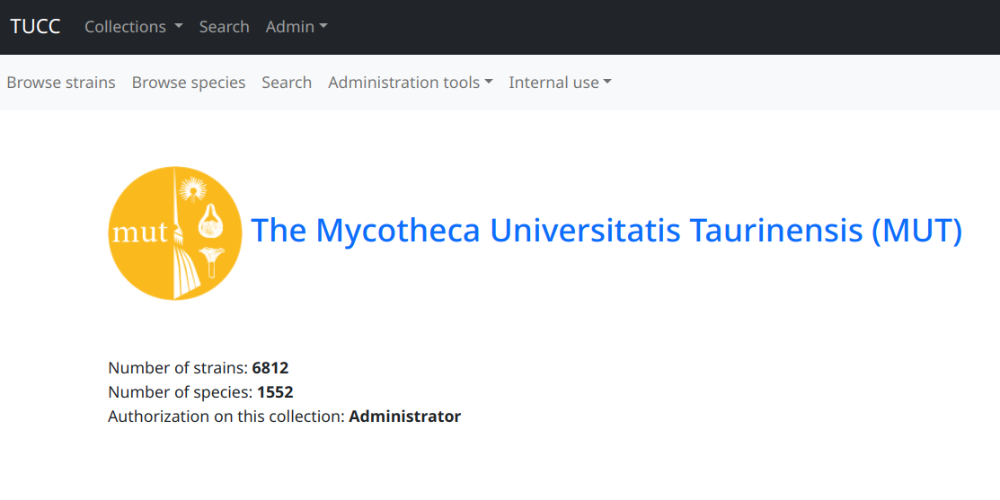
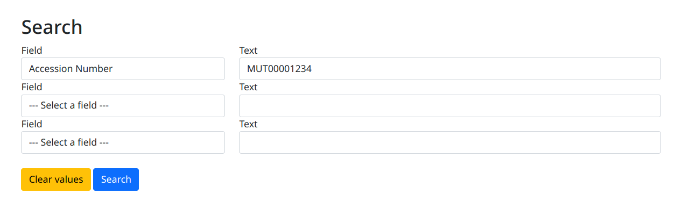
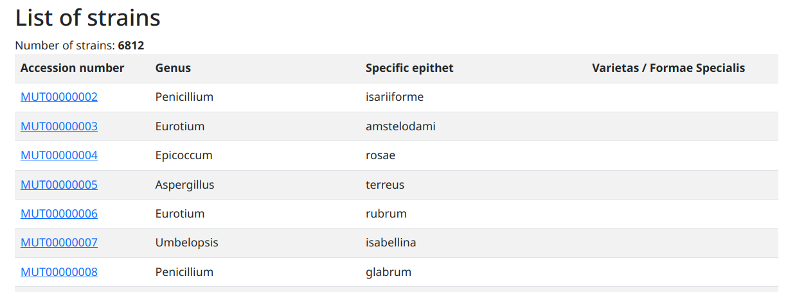
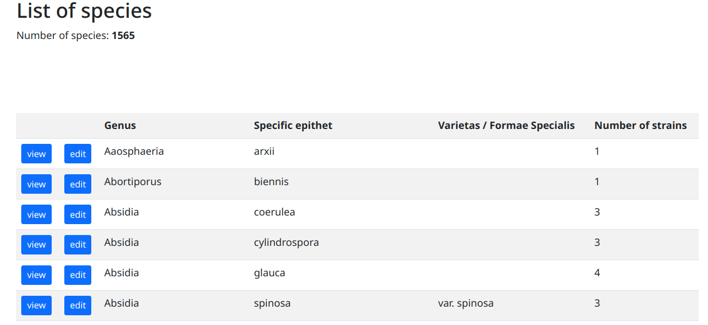

============================================
Guida all'uso del servizio TUCC database
============================================

.. sections levels: = - ~ . _

Data rilascio: _DATE_

Il servizio TUCC database è disponibile all'indirizzo:

`www.tucc-database.unito.it <https://www.tucc-database.unito.it/>`_

.. contents:: Table of Contents
   :depth: 1

Menù Collections
=========================

Questo menù permette di accedere alle collezione per eseguire operazioni relative alla collezione selezionata.

Al momento la TUCC contiene 7 collezioni:

* Mycotheca Universitatis Taurinensis (MUT)
* Collection MiAGR - settore Microbiologia Alimentare, Agraria e Ambientale
* Collection MiAGR - settore Patologia Vegetale Agraria
* Collection MiAGR - settore Patologia vegetale forestale
* Collection MiBAT - settore microbiologia clinica umana
* Collection MiVET - settore Microbiologia Clinica Veterinaria
* Collection MiVET - settore Parassitologia

Quando una collezione è selezionata la pagina **Home** della collezione è visualizzata.

Un secondo menù (con sfondo chiaro) è visualizzato sotto il menù principale.
Questo menù permette di accedere alle funzioni relative alla collezione selezionata:

* `Browse strains`_
* `Browse species`_`
* Search
* Administration tools
* Internal use

Menù Search
=========================

Questa funzione permette di ricercare ceppi in tutte le collezioni della TUCC.

La ricerca può essere eseguita specificando il nome del campo oppure su tutti i campi (*All fields*).

I risultati sono presentati in una tabella dove il codice d'accesso è costituito da un link alla scheda ceppo.

.. _Browse strains:

Browse strains
=========================

Questa funzione presenta un elenco di tutti i ceppi presenti nella collezione selezionata.

The strains of the selected collection are displayed in a table with 4 columns:

* Accession number
* Genus
* Specific epithet
* Varietas / Formae Specialis

A strain can be displayed by clicking on its **Accession number**

.. _Browse species:

Browse species
=========================

Questa funzione presenta un elenco di tutti le specie presenti nella collezione selezionata.

La colonna **Number of strains** indica il numero di ceppi di questa specie presenti nella collezione.

Administration tools
=========================

.. include:: administration_tools.rst

Internal use
=========================

.. include:: internal_use.rst

.. _scheda ceppo:

Scheda ceppo
=========================

.. include:: scheda_ceppo.rst

Richiesta di deposito
===============================

.. include:: deposit_request.rst

.. _super tools:

Super tools
=========================

.. include:: super_tools.rst

.. _elenco campi:

Elenco dei campi
=========================

.. include:: elenco_campi.rst

.. _Menù admin:

Menù admin
==================================================

.. Authorize an user

.. include:: authorize_an_user.rst

.. list of authorized users

.. include:: list_of_authorized_users.rst

Web service version
-------------------------------------

Questa funzione visualizza la versione del web service

Web site analytics
---------------------------------------

Questa voce permette di acceddere a statistiche di accesso del web service TUCC

Aggiornamento del sito web MUT
==================================================

.. include:: aggiornamento_sito_mut.rst