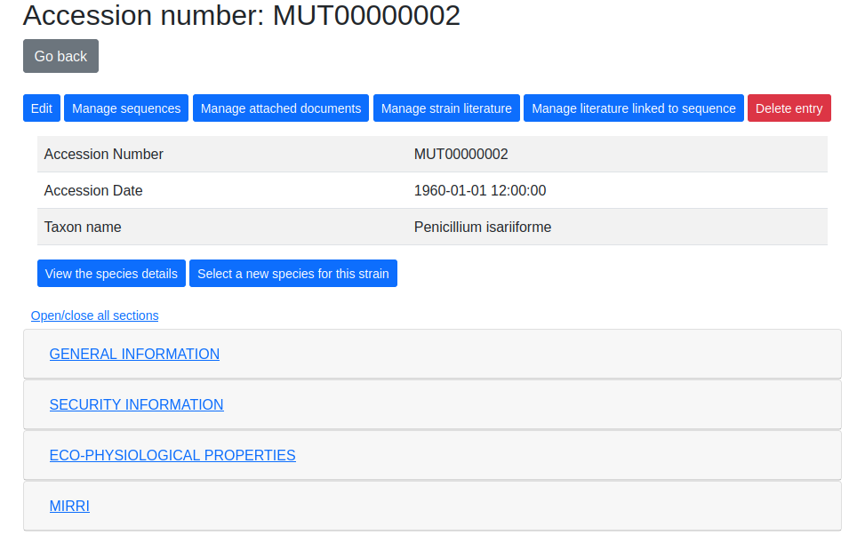
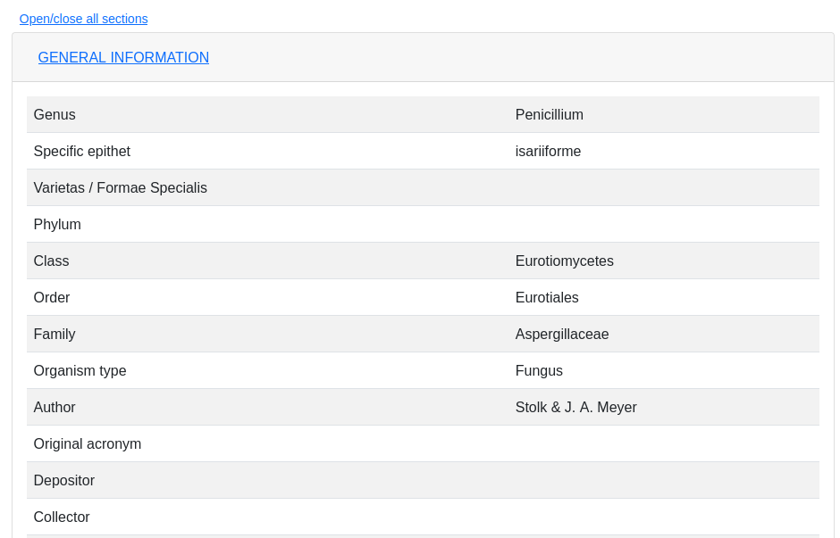
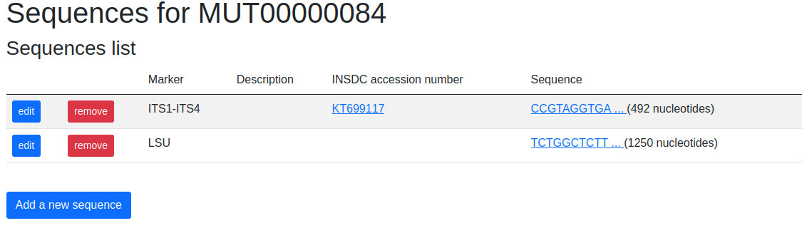

La scheda ceppo visualizza tutti i campi relativi al ceppo selezionato.

I campi sono visibili secondo il livello di privileggio

Exempio di scada ceppo:

Di default le sezioni di campi **GENERAL INFORMATION**, **SECURITY INFORMATION**, **ECO-PHYSIOLOGICAL PROPERTIES** e **MIRRI** sono chiuse.
Un click sul nome della categoria permette di aprirela o richiuderla. Un click su **Open/Close all sections** permette di aprire o chiudere tutte le sezioni.

Esempio di campi visualizzati. Vengono visualizzati i campi anche se non contengono valori

Varie funzioni sono accessibili dalla scheda ceppo:

Edit
---------------------------------

Funzione per editare i campi della scheda ceppo

Manage sequence
---------------------------------

Questa funzione permette di aggiungere, modificare o rimuovere le sequenze nucleotidiche relative al ceppo.

Aggiungere/modificare una sequenza
~~~~~~~~~~~~~~~~~~~~~~~~~~~~~~~~~~~~~~~~~

Premere sul pulsante **Add a new sequence** o sul pulsante **Edit** corrispondente alla sequenza da modificare.

.. image:: sequences2.png
    :alt: modificareu una sequenza
    :width: 100%

Immettere i dati nei vari campi.

Il campo **INSDC Accession number** deve contenere un codice d'accesso valido.

Nel campo **Nucleotide sequence** solo nucleotidi sono accettati. Vedere il `codice IUPAC per i nucleotidi <https://www.bioinformatics.org/sms/iupac.html>`_

Salvare la sequenza premendo il pulsante **Submit sequence**

Manage attached documents
---------------------------------

Manage strain literature
---------------------------------

Manage strain literature linked to sequence
--------------------------------------------------

Delete entry
---------------------------------

Questa funzione richiede il livello di privileggio **Administrator** nella o nelle collezioni corrispondenti

Questa funzione permette di cancellare il ceppo, non sarà più visibile a nessun utente.

Un ceppo cancellato (*Deleted*) potrà essere ripristinao da un utente Administrator (vedere **Deleted entries**)

View the species details
---------------------------------

Select a new species for this strain
-------------------------------------------

