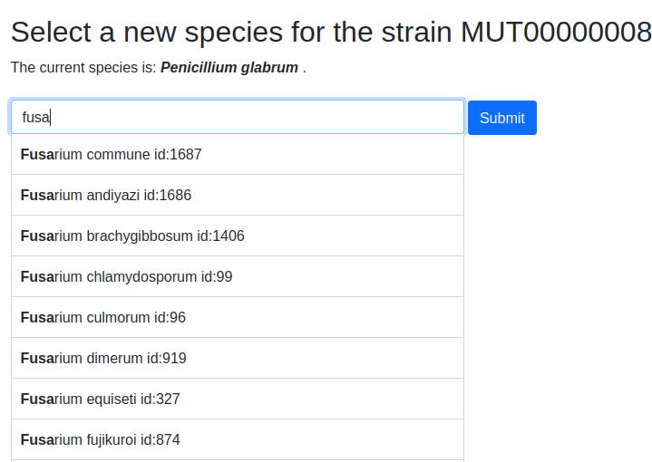

La scheda ceppo permette di visualizzare tutti i campi relativi al ceppo selezionato.

I campi sono visibili secondo il livello di privileggio

Exempio di scheda ceppo:

Di default le sezioni di campi **GENERAL INFORMATION**, **SECURITY INFORMATION**, **ECO-PHYSIOLOGICAL PROPERTIES** e **MIRRI** sono ripiegate.
Un click sul nome della categoria permette di aprirela o ripiegarla. Un click su **Open/Close all sections** permette di aprire o ripiegare tutte le sezioni.

Esempio di campi visualizzati. Vengono visualizzati i campi anche se non contengono valori

Varie funzioni sono accessibili dalla scheda ceppo:

Edit
---------------------------------

Funzione per editare i campi della scheda ceppo. Richiede un livello di privilegi adeguato.

Manage sequences
---------------------------------

Questa funzione permette di aggiungere, modificare o rimuovere le sequenze nucleotidiche relative al ceppo.

La sequenza nucleotidica può essere visualizzata cliccando sul suo codice d'accesso (se fornito) oppure su i primi 10 nucleotidi della sequenza.

Aggiungere/modificare una sequenza
~~~~~~~~~~~~~~~~~~~~~~~~~~~~~~~~~~~~~~~~~

Premere sul pulsante **Add a new sequence** o sul pulsante **Edit** corrispondente alla sequenza da modificare.

Immettere i dati nei vari campi.

Il campo **INSDC Accession number** deve contenere un codice d'accesso valido.

Nel campo **Nucleotide sequence** solo nucleotidi sono accettati. Vedere il `codice IUPAC per i nucleotidi <https://www.bioinformatics.org/sms/iupac.html>`_

Salvare la sequenza premendo il pulsante **Submit sequence**

Manage attached documents
---------------------------------

Questa funzione permette di allegare documenti al ceppo.
Alcuni tipi di documento sono definiti (**PIC**, **MTA**, **MAA**, **MIRRI ABS related file**, **MIRRI MTA file**)
Per caricare un documento di tipo non predefinito scegliere **Other** il sistema richiederà il tipo di documento allegato **Other document type**.

Utilizzare il pulsante **Browse** per scegliere il documento e quindi premere **Upload file** per salvarlo.

Manage strain literature
---------------------------------

Manage strain literature linked to sequence
--------------------------------------------------

Delete entry
---------------------------------

Questa funzione richiede il livello di privileggio **Administrator** nella o nelle collezioni corrispondenti

Questa funzione permette di cancellare il ceppo, non sarà più visibile a nessun utente.

Un ceppo cancellato (*Deleted*) potrà essere ripristinao da un utente Administrator (vedere **Deleted entries**)

View the species details
---------------------------------

Questa funzione permette di visualizzare i dettagli della specie del ceppo:

La specie può essere modificata premendo sul pulsante **Edit**.
Le modifiche apportate alla specie saranno applicate a tutti i ceppi di quella specie.

Select a new species for this strain
-------------------------------------------

Questa funzione permette di modificare la specie del ceppo.

Digitare i primi carattere del genere e quindi selezionare la specie nell'elenco proposto.
Premere il pulsante **Submit** per assegnare la nuova specie al ceppo.

