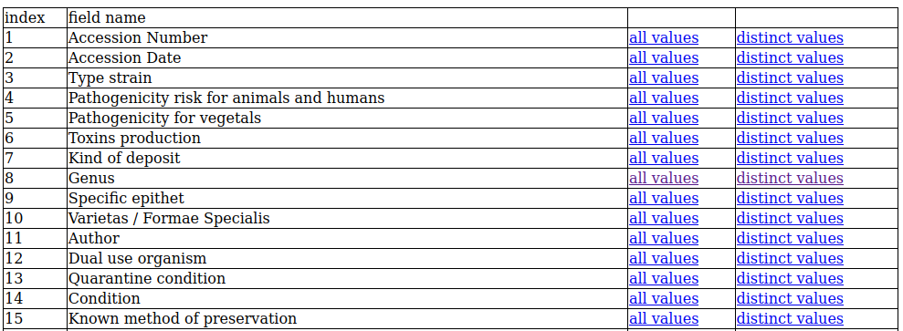

.. super admin

La pagina **Super admin** permette di accedere a funzioni utili per la manutenzpone del database

Indexes of field
-------------------------------------------

Questa funzione presenta una tabella contenente tutti i campi della record ceppo.

Per ogni campo 2 link sono disponibili:

All values
~~~~~~~~~~~~~~~~~~~~~~~~~~~~~~~~~~

Questo link permette di accedere ai valori del campo selezionato per tutti i ceppi del database. Cliccando sul codice d'accesso si accede alla scheda ceppo.

Distinct values
~~~~~~~~~~~~~~~~~~~~~~~~~~~~~~~~~~

questo link permette di visualizzare tutti i valori **distinti** del campo selezionato con il numero di ceppi corrispondenti.

.. image:: distinct_values.png
    :alt: tutti i valori distinti di un campo
    :width: 60%

