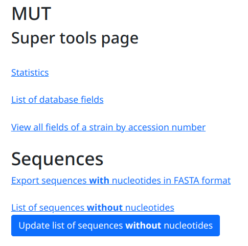
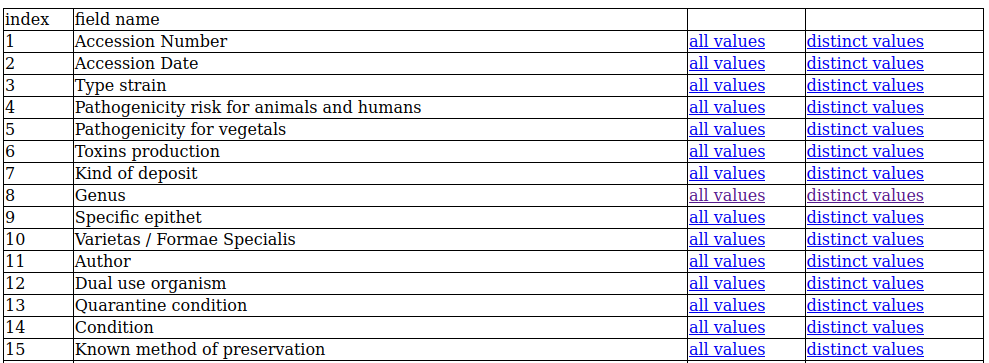
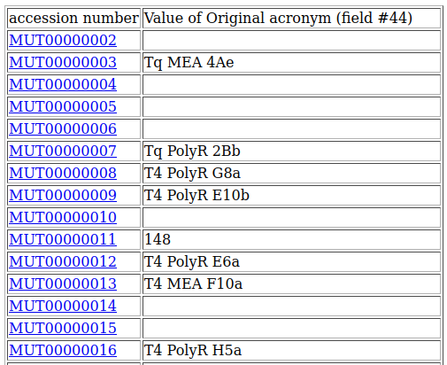
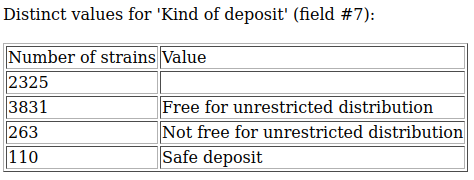
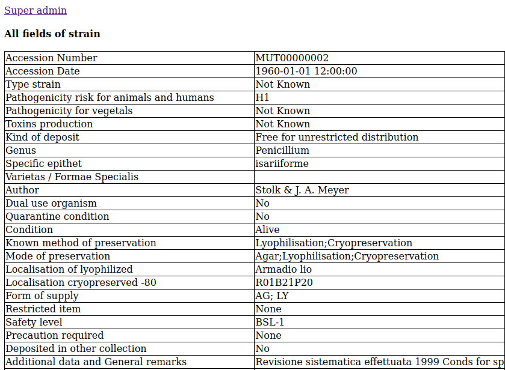
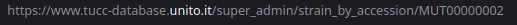

.. super tools

La pagina **Super tools** permette di accedere a funzioni utili per la manutenzione del database.
Il privileggio **Administrator** o **Advanced user** è richiesto.

Statistics
-------------------------------------------

Questa pagina presenta dati statistici sulla collezione

Esempio:

* Number of strains with MDS: 3379
* Number of strains with MIRRI mandatory fields: 497
* Number of strains labeled to export to MIRRI: 334
* 3036 sequences
* 0 genomes

List of database field
-------------------------------------------

Questa funzione presenta una tabella contenente tutti i campi della record ceppo.

Per ogni campo 2 link sono disponibili:

All values
~~~~~~~~~~~~~~~~~~~~~~~~~~~~~~~~~~

Questo link permette di accedere ai valori del campo selezionato per tutti i ceppi del database. Cliccando sul codice d'accesso si accede alla scheda ceppo.

Distinct values
~~~~~~~~~~~~~~~~~~~~~~~~~~~~~~~~~~

questo link permette di visualizzare tutti i valori **distinti** del campo selezionato con il numero di ceppi corrispondenti.

View all fields of a strain by accession
----------------------------------------------------------------------------------

Questa funzione permette di visualizzare la scheda ceppo in un modo compatto.

Per accedere a un ceppo particolare cambiare la URL e immettere il codice d'accesso del ceppo richiesto:

